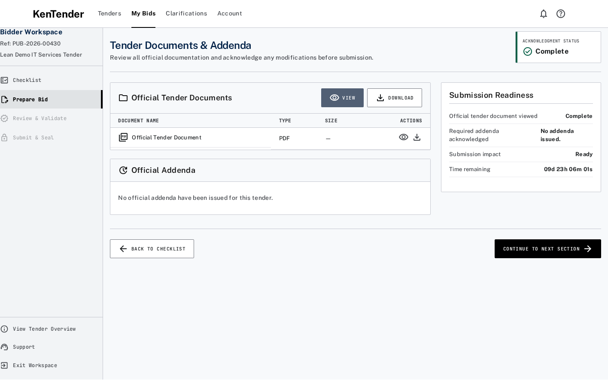

# Bidder Presentation Boundary Correction Report

## Goal

Restore the approved Stitch A3 content hierarchy on `/tenders/<publication_ref>/documents` so bidders see only intentionally published documents and task-relevant metadata — never internal package hashes, schemas, manifests, or configuration artifacts — while keeping server-side integrity binding for acknowledgement, audit, and addendum invalidation.

## Root cause

1. **Package confirmation inventory mapped into the bidder document table.**  
   `package_summary_dto()["items"]` is a PE/internal checklist (configuration references, schemas, readiness report, document hash, etc.). An earlier overview helper treated those rows as downloadable documents (`Package Artifact`).

2. **Binding digests were returned on the bidder DTO and partially rendered.**  
   `get_tender_documents_addenda` exposed `package_summary`, `package_context` (`document_hash`, `configuration_version`, `addenda_set_digest`), and a `package_display` meta line. Even when the UI stopped showing digests as “version”, hashes remained in the API/page context.

3. **No explicit bidder-facing projection.**  
   Overview/documents responses carried internal ids (`configuration_id`, `publication_id`, `bid_id`) and nested package DTOs rather than an allowlisted presentation model.

## Exact API and template files corrected

| Area | Path |
|---|---|
| Presentation allowlist helpers | `kentender_procurement/.../services/bidder_presentation.py` |
| A3 documents DTO + ack binding | `.../services/tender_documents_addenda.py` |
| A1 overview DTO + server resolve | `.../services/published_tender_overview.py` (`resolve_published_tender_backend`) |
| A0 list PDF URLs / ids | `.../services/available_tenders.py` |
| A2 checklist DTO / PDF URL | `.../services/submission_checklist.py` |
| A4 matrix DTO | `.../services/requirement_matrix.py` |
| Form of Tender DTO / save | `.../services/form_of_tender.py` |
| Pub-ref PDF download | `.../api.py`, `.../__init__.py` → `download_published_tender_document_pdf` |
| A3 Website template | `.../www/tenders/documents.html` |
| A1 Website overview PDF links | `.../www/tenders/overview.py` |
| Desk A1 PDF open | `.../public/js/published_tender_overview_page.js` |
| Guidance rule | `docs/bidder-workspace/README.md` |
| Regression tests | `.../tests/test_bidder_presentation_boundary.py` (+ updates to S100/A3/A2 tests) |
| Playwright A3 | `tests/ui/smoke/bidder-workspace/a3-documents-addenda.spec.ts` |

## Removed bidder-visible fields

From A3 (and aligned A0–A4 bidder DTOs where applicable):

- `package_summary` / `confirmed_package` / `package_context` / `package_display`
- `document_hash`, `configuration_version`, `addenda_set_digest`, package digests
- Internal package inventory rows (schemas, readiness report, config/package references, etc.)
- Technical labels: Package Artifact, Digest, Hash, SHA-256, Schema (as package inventory), Manifest, BWMF
- `configuration_id`, `configuration_ref`, `publication_id`, `bid_id` on bidder GET DTOs
- Desk bridge URLs embedding configuration ids
- PDF download URLs keyed by `configuration_id=` (replaced with `published_tender_ref`)
- “Current package:” / publication meta line under the A3 title (not in Stitch A3)

## Retained internal integrity controls

- `Confirmed Tender Document Package.document_hash` and package inventory remain in the database.
- Acknowledgement payloads still store `package_document_hash`, `addenda_set_digest`, `publication_ref`, and per-addendum `version_or_hash`.
- Read-path invalidation via `ack_binding_is_current` / `supersede_stale_acknowledgement` unchanged in semantics.
- Server-only `resolve_published_tender_backend()` loads publication/config/package/bid for composition; it is not returned to bidder clients.
- `append_issued_addendum` still returns digests to Administrator callers for registry ops.

## Named test results

| Suite | Result |
|---|---|
| `test_bidder_presentation_boundary` (6 tests) | **OK** |
| `test_lean_s100_tender_documents_addenda` (5) | **OK** |
| `make bw-a3-domain-gate` (A3 API + web + presentation) | **OK** |
| `test_submission_checklist_api` (10, 1 skipped) | **OK** |
| `make ui-bidder-a3-gate` / A3 Playwright + screenshot assertions | **OK** (1 passed) |

Evidence commands:

```bash
bench --site kentender.midas.com run-tests --module kentender_procurement.tender_configurations.tests.test_bidder_presentation_boundary
cd apps/kentender_v1 && make bw-a3-domain-gate && make ui-bidder-a3-gate
```

## Corrected screenshot



Path: `docs/bidder-workspace/A3-documents-and-addenda/artifacts/a3-presentation-boundary-corrected.png`

Stitch A3 hierarchy restored in the live page: title **Tender Documents & Addenda**, subtitle, **Acknowledgment Status** KPI, **Official Tender Documents** table, **Official Addenda**, **Submission Readiness** — without package/digest/artifact panels.

## Permanent presentation rule (added to bidder workspace guidance)

> Bidder-facing screens and APIs must expose only information needed to understand or complete a bidder task. Internal hashes, digests, schema names, manifest identifiers, configuration references, database IDs, artifact types and audit metadata must never appear in bidder-visible HTML, API DTOs, accessibility text, tooltips, filenames or error messages.

## Stop

This correction stops here. No further bidder section work was started.
