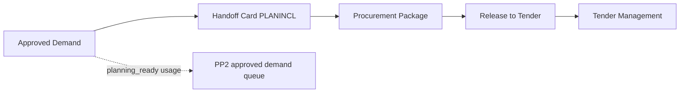

# Procurement Planning MVP-1 — Gate 00 Replacement Boundary

**Document ID:** PLANNING-MVP1-GATE-00-1.0  
**Status:** Approved  
**Date:** 9 August 2026  
**Authority:** `PLANNING-MVP1-REQ-1.4` → `PLANNING-MVP1-CURSOR-1.2` → Contract v2.4  
**Tracker:** `PLN-GATE-00`  
**Scope:** Read-only audit + clean replacement boundary. **No domain or UI implementation in this gate.**

---

## 1. Goal

Approve the exact clean replacement boundary for Procurement Planning MVP-1 so Gate 01+ can build the Plan / Plan Version / Plan Item model with **zero PP2 Planning code remaining**. Inclusion / Package / Release are removed before Gate 01 — not preserved beside MVP-1.

---

## 2. Current-state map (audit summary)

Live code under `kentender_procurement/.../procurement_planning/` is **PP2**. MVP-1 Plan Item / Plan Version DocTypes and services do **not** exist yet.

| Layer | What exists today | Path root |
|---|---|---|
| DocTypes | Procurement Plan; Package + Line; Method/Review/Readiness decisions; Release Consumption; Planning Audit; Templates/profiles | `kentender_procurement/.../procurement_planning/doctype/` |
| Inclusion | Not a DocType — `Procurement Handoff Card` via `planning_inclusion_service` | services + lifecycle |
| Demand bridge | `Planning Consumption` DocType + `planning_ready` / `planning_usage` on Demand | `.../demands/` |
| UI | PP4 workbench iframe (`/desk/procurement-planning`), Planning Hub, package wizard, package-detail | `pp2_planning_router.js`, pages, ~79 Playwright specs |
| APIs | ~80 whitelisted PP2 endpoints (package/release/workflow) | `procurement_planning/api/` |
| Seeds | `seed_procurement_planning_works_master` + thin `works_master_planning_seed` shim; F1/PP3 slices | `procurement_planning/seeds/` |
| Tests | ~175 PP2 Python modules; Demands consume tests | `procurement_planning/tests/`, `demands/tests/` |
| MVP seed | `KENTENDER_MVP_V1` stops at Demands — no Planning stage for `PLN-MOH-2027-001` | Contract v2.4 Planning fixtures are doc-only until Gate 02 |

### Inbound live dependencies (must not break blindly)

- TM / Tender Config: `Procurement Package` + `pp2_constants` statuses; `create_tender_from_package`
- PLC: PKGREL handoff, journey status mapping, works-master full seed
- Procurement Home: `approved_demand_queue`, `pp2_constants`, `pp_scope`
- Desk hooks: Plan/Package `permission_query` + `has_permission`
- Core module registry / workspace “Procurement Planning”
- Demands: owns `Planning Consumption` (Planning should call it; PP2 inclusion largely does not today)

Budget has almost no inbound callers into Planning (Planning → Budget outbound only).

---

## 3. Keep / replace / retire

### 3.1 Keep (shared infrastructure — rebind, do not rebuild from scratch)

| Artifact | Notes |
|---|---|
| Module label **Procurement Planning** | Product name stays |
| Workspace + sidebar slot | Update routes for MVP-1 Desk pages |
| `kentender_core` module_registry entry | Rebind `routePrefixes` / pages when MVP UI lands |
| Org-scope / permission **pattern** | Rebind `pp_scope`-style checks to new Plan / Plan Item DocTypes |
| Demand `planning_ready`, `planning_usage` | Upstream eligibility |
| Demands-owned **Planning Consumption** + `consume_demand_in_planning` | Wire Effective allocations on plan approval |
| Shared Desk chrome | `kt-stitch-canvas`, form errors, shell/nav |
| Audit / notification infrastructure | New MVP-1 event shapes; drop Package-review Notification Log with PP2 UX |

### 3.2 Replace (rebuild under same product name — disposable data OK)

| Artifact | Target |
|---|---|
| **Procurement Plan** DocType semantics | MVP-1 logical Plan (`Open` / `Closed` / `Cancelled`) + separate Plan Version records |
| PP2 sole status model on Plan | Do not keep `Draft/Active/Closed/Cancelled/Superseded` as the only lifecycle |
| Approved-demand eligibility projection | `list_eligible_demands` / workspace queues |
| Primary Desk UX | Stitch PLN-UI-01…10 hand-ports — **no iframe workbench** |

### 3.3 Retire — full removal before Gate 01 (mandatory)

**Execution track:** [GATE_PP2_RETIREMENT.md](GATE_PP2_RETIREMENT.md) v1.1 (`PLN-RET-*`).

**User mandate (2026-08-09):** No PP2 Planning code may remain. There is **no** temporary preserve of Package, WORKS Planning seed, or PP2 APIs.

Remove entirely before Gate 01:

- Planning Inclusion (Handoff Card) as the planning unit
- Procurement Package / Package Line and all package decision/readiness/release DocTypes
- Package workbenches, wizard, package-detail, readiness/review/release UX
- Manual Released / Consumed actions and Release Package objects
- Template / risk / KPI / decision-profile builders inside Planning
- PP2 Playwright pack and `test_pp2_*` / `test_pp3_*` / `test_pp4_*`
- F1 / PP3 / WORKS PP2 Planning seeds and `pp2_constants`
- All Home / TM / PLC / TCFG call sites that require Package — rewire or delete in RET-003

**Hard rule:** Zero dual-write. Zero leftover PP2 Planning path.

### 3.4 Superseded — temporary preserve (void)

Section formerly allowing Package/WORKS preserve for TM/PLC is **void**. Do not reinstate.

### 3.5 Discardable data / migrations

- All PP2 Planning transactional data
- Do not migrate Inclusion/Package history into Plan Items
- One-shot PP2 patches (`p3_006`…): leave applied history; do not extend
- District Hospital Renovation / competing seeds: remove from Planning path

---

## 4. Target records and services (Gate 01+)

### Records (exact names)

- Procurement Plan
- Procurement Plan Version
- Procurement Plan Item
- Procurement Plan Item Version
- Plan Demand Allocation
- Departmental Submission
- Plan Decision
- Plan Validation Result
- Publication Event
- Planning Handoff Snapshot

### Services (exact names from Requirements v1.4)

- `get_planning_workspace`
- `create_procurement_plan`
- `list_eligible_demands`
- `add_demand_to_plan`
- `update_plan_item`
- `aggregate_plan_allocations`
- `validate_plan`
- `submit_departmental_contribution`
- `submit_plan_for_review`
- `record_plan_decision`
- `approve_plan_version`
- `open_or_create_plan_revision`
- `cancel_plan_revision`
- `publish_approved_plan`
- `create_tender_from_plan_item`
- `get_plan_implementation`
- `get_plan_audit`

### UI

Desk pages hand-porting `ui_design/PLN-UI-01.html` … `PLN-UI-10.html` — no second shell, no iframe.

---

## 5. Ordered gates after Gate 00

| Gate | Focus | Tracker |
|---|---|---|
| **00** | This boundary | `PLN-GATE-00` |
| 01 | Clean domain + invariants; retire obsolete structures **inside boundary only** | `PLN-SCH-*` |
| 02 | Roles/scope + `KENTENDER_MVP_V1` Planning seed + `SCN-PLN-ADD-001` | `PLN-PERM-*`, `PLN-SEED-*` |
| 03–06 | PLN-UI-01…10 + services | `PLN-UI-*`, `PLN-SVC-*` |
| 07 | Publication, Plan Item tender handoff, Home/Demands rewire; TM MVP path | `PLN-INT-*` |
| 08 | Traceability + abs gate; freeze/retire PP2 Planning UI tests from MVP DoD | `PLN-AC` / `NFR` / `ABS` |

---

## 6. Risks and mitigations

| Risk | Mitigation |
|---|---|
| TM/PLC/Home import Package | RET-003 removes or rewrites those call sites **before** Gate 01; Package DocTypes are deleted in RET-004 |
| PP2 tests fail | Delete or retire those tests in RET-004; they are not kept green |
| Demands `Planning Consumption.package` link | Drop Package link in RET-004; MVP uses `plan_item_code` only |

---

## 7. Tests required at each gate

| Gate | Evidence |
|---|---|
| **00** | This document + tracker `PLN-GATE-00` Done |
| 01 | Domain invariant unit/transactional tests; abs search for dual-write |
| 02 | Role/scope matrix; seed reset ×2; cross-entity isolation |
| 03–06 | Service + Playwright per PLN-UI surface; SCN-PLN-ADD-001 e2e at 06 |
| 07 | Contract tests Demands / Budget / Core / Tender boundaries |
| 08 | Full PLN-AC-001…034 / NFR / ABS Makefile gates |

---

## 8. Explicit non-goals of Gate 00

- No new DocTypes, services, Desk pages, or migrations
- No deletion of Package DocTypes
- No dual-write adapters Plan Item ↔ Package
- No start of Gate 01 until explicitly requested

---

## 9. Approval

This boundary is **approved** as of 9 August 2026 for Procurement Planning MVP-1 implementation.

**Next:** Complete [GATE_PP2_RETIREMENT.md](GATE_PP2_RETIREMENT.md) RET-002→005 (**full removal**). Gate 01 only after RET-005 is Done.
