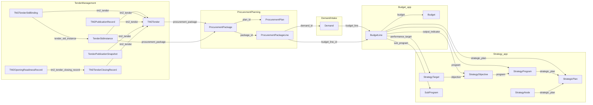

# G0-002 — Existing module object map (PLC rectification)

**Parent gate:** [G0-002](./3.%20procurement_lifecycle_usability_handoff_rectification_implementation_tracker.md)  
**Atomic tickets:** LV-G0-002-01 … LV-G0-002-07  
**Spine contract:** [Rectification pack §6.2](./0.%20procurement_lifecycle_usability_handoff_rectification_pack.md) (table) and [§7](./0.%20procurement_lifecycle_usability_handoff_rectification_pack.md) (handoff field model)  
**DocType index:** [doctypes_inventory.csv](../../audit/module_implementation_catalog/doctypes_inventory.csv)  
**Prior inventory:** [G0-001_repository_inventory.md](./G0-001_repository_inventory.md)  
**Generated:** 2026-05-15 — evidence from DocType JSON + cited Python services under `apps/kentender_v1/`.

**Path convention:** paths below are repo-relative to `apps/kentender_v1/` unless noted.

---

## Evidence summary (§3.2 template)

```text
Implementation Evidence:
- DocType JSON paths and fieldnames cited in sections LV-G0-002-01 … LV-G0-002-07.
- Service: kentender_procurement/kentender_procurement/tender_management/services/release_procurement_package_to_tender.py
- Service: kentender_procurement/kentender_procurement/tender_management/services/create_tender_from_package.py

Test Evidence:
- N/A for G0-002 (documentation-only gate).

Result:
- G0-002 and LV-G0-002-01–07 **Accepted** in implementation tracker §5 / §18.1.

Review Notes:
- Decision: **Accepted** — recorded in [implementation tracker](./3.%20procurement_lifecycle_usability_handoff_rectification_implementation_tracker.md) §5 / §18.1 (G0-002 + LV-G0-002-01…07).
- Pack vs cursor naming: resolved choices are stated in LV-G0-002-01 and the E2E section.
```

---

## Pack vs cursor implementation sketch (alignment only)

| Source | Strategy step label | Declared `source_object_type` (cursor §5.2) | **Resolved for this repo** (see LV-G0-002-01) |
|--------|----------------------|-----------------------------------------------|-----------------------------------------------|
| Pack §6.2 row 1 | Strategic Priority | (not in snippet) | Tree: `Strategic Plan` → `Strategy Program` / `Strategy Node` / `Strategy Objective` / `Strategy Target` |
| Cursor §5.2 | Strategy Priority | `Strategic Objective` | **Incorrect as sole type** — use full tree; `Strategy Objective` is one leaf type with `objective_code`. |

---

## LV-G0-002-01 — Strategy: spine step 1 → DocTypes and `object_code` candidates

**Spine (pack §6.2):** step 1 — Strategic Priority — Strategy module — main objects “Strategic Plan / Programme / Objective”.

### DocTypes (Kentender Strategy)

| DocType | JSON path | Naming / identity | Candidate journey `object_type` | Candidate `object_code` / display key |
|---------|-----------|-------------------|----------------------------------|----------------------------------------|
| Strategic Plan | `kentender_strategy/kentender_strategy/kentender_strategy/doctype/strategic_plan/strategic_plan.json` | Doc `name` user-set (`allow_rename`); `strategic_plan_name` (Data, required) | `Strategic Plan` | Doc `name` (primary key) or `strategic_plan_name` for display (not guaranteed unique in JSON) |
| Strategy Program | `…/strategy_program/strategy_program.json` | `autoname`: hash; `program_code`, `program_title` | `Strategy Program` | Doc `name` (PK) or `program_code` when populated |
| Strategy Objective | `…/strategy_objective/strategy_objective.json` | hash; `objective_code`, `objective_title` | `Strategy Objective` | Doc `name` or `objective_code` |
| Strategy Target | `…/strategy_target/strategy_target.json` | hash; `target_code`, `target_title` | `Strategy Target` | Doc `name` or `target_code` |
| Strategy Node | `…/strategy_node/strategy_node.json` | hash; tree via `parent_strategy_node`, `node_type` ∈ Program / Objective / Target | `Strategy Node` | Doc `name`; display `node_title` |
| Sub Program | `…/sub_program/sub_program.json` | hash; `sub_program_code`, `title` | `Sub Program` | Doc `name` or `sub_program_code` |
| Strategy Navigation | `…/strategy_navigation/strategy_navigation.json` | Single DocType (`issingle`) — desk shell only | — | **Not** a lifecycle business object for `object_code` |

### Joins inside Strategy

- `Strategy Program.strategic_plan` → `Strategic Plan`
- `Strategy Objective` → `Strategic Plan`, `Strategy Program`
- `Strategy Target` → `Strategic Plan`, `Strategy Program`, `Strategy Objective`
- `Strategy Node.strategic_plan` → `Strategic Plan`; optional `parent_strategy_node` for hierarchy
- `Sub Program.program` → `Strategy Program`

### Budget / Demand consumption (downstream preview)

- `Budget Line` links `strategic_plan`, `program`, `sub_program`, `output_indicator` (Link to **Strategy Objective**), `performance_target` (**Strategy Target**) — see LV-G0-002-02.

---

## LV-G0-002-02 — Budget: “Funding Available” → Budget Line (+ Budget / Funding Source)

**Spine (pack §6.2):** step 2 — Funding Available — Budget — **Budget Line** — handoff “Budget Funding Confirmation” (card layer **R2+**, not a DocType row today).

### DocTypes (Kentender Budget)

| DocType | JSON path | Identity | Links toward Strategy | Links toward Demand |
|---------|-----------|----------|------------------------|---------------------|
| Budget Line | `kentender_budget/kentender_budget/kentender_budget/doctype/budget_line/budget_line.json` | `autoname`: `field:budget_line_code` — **`budget_line_code` is the stable business code**; `budget_line_name` is title | `strategic_plan`, `program` (Strategy Program), `sub_program`, `output_indicator` → **Strategy Objective**, `performance_target` → **Strategy Target** | **Demand.budget_line** → Budget Line (see LV-G0-002-03) |
| Budget | `…/budget/budget.json` | `autoname`: `format:BUD-{procuring_entity}-{fiscal_year}-.{####}` | `strategic_plan` | Via lines / Demand.`budget` (read-only on Demand) |
| Funding Source | `…/funding_source/funding_source.json` | (reference) | — | `Budget Line.funding_source` |
| Budget Navigation | `…/budget_navigation/budget_navigation.json` | `issingle` — desk only | — | — |

### Warnings / “amount available” UI (field basis)

From `Budget Line`: `amount_allocated`, `amount_reserved`, `amount_consumed`, `amount_available` (read-only), `is_active`, removal audit `removed_at` / `removed_by`.

---

## LV-G0-002-03 — Demand Intake: steps 3–4 → Demand, Demand Item; permissions

**Spine:** Need Captured / Need Approved — **Demand** — handoffs “Demand Submission Record” / “Demand Approval Certificate” (card layer **R2+**).

### DocTypes

| DocType | JSON path | Identity | Budget / strategy | Planning linkage |
|---------|-----------|----------|-------------------|-------------------|
| Demand | `kentender_procurement/kentender_procurement/demand_intake/doctype/demand/demand.json` | `autoname`: hash; read-only **`demand_id`** (unique) for business-facing id | **`budget_line`** (required), mirrored read-only: `strategic_plan`, `program`, `sub_program`, `output_indicator`, `performance_target`, `budget`, `funding_source`, reservation fields | **`planning_status`** (Not Planned / Partially Planned / Fully Planned / Planning Ready). **No `Link` field to Procurement Plan** on the Demand DocType — association to planning is **via `Procurement Package Line.demand_id`** (LV-G0-002-04) or server logic (TBD if additional indexes exist). |
| Demand Item | `…/demand_item/demand_item.json` | Child table `Demand.items` | — | — |

### Workflow fields (DIA spine states)

- `status`: Draft → Pending HoD Approval → Pending Finance Approval → **Approved** / Planning Ready / Rejected / Cancelled.
- Approval / rejection / return / cancel metadata: `hod_*`, `finance_*`, `rejected_*`, `return_*`, `cancelled_*`, etc. (see JSON).

### Permission / query hooks (touchpoint)

- `kentender_procurement/kentender_procurement/hooks.py` → `permission_query_conditions` / `has_permission` → `demand_intake.permissions.demand_permissions` (see [G0-001](./G0-001_repository_inventory.md) §LV-G0-001-03). Any journey API must reuse these rules (**G0-006**).

---

## LV-G0-002-04 — Procurement Planning: steps 5–7 → Plan, Package, Lines; PKGREL; release hook

**Spine:** Procurement Planned / Package Prepared / Package Released — **Procurement Plan** / **Procurement Package** / **Procurement Package Line** — **Planning Release Package** (handoff **PKGREL-*** in examples).

### DocTypes

| DocType | JSON path | Business codes | Demand / budget | Plan ↔ package |
|---------|-----------|----------------|-----------------|----------------|
| Procurement Plan | `kentender_procurement/kentender_procurement/procurement_planning/doctype/procurement_plan/procurement_plan.json` | `autoname`: **`field:plan_code`** — `plan_code` unique; `plan_name` | (no direct Demand link at plan header) | Parent of packages |
| Procurement Package | `…/procurement_package/procurement_package.json` | **`package_code`** read-only unique (generated); Doc `name` is PK; **`plan_id`** → Procurement Plan; `template_id` → Procurement Template | Demand lines via builder UI (`demand_lines_html`); see lines | `status`, `planning_status`, **`released_to_tender_at`** |
| Procurement Package Line | `…/procurement_package_line/procurement_package_line.json` | **`package_line_code`** (unique, indexed) | **`demand_id`** → Demand (required), **`budget_line_id`** → Budget Line (required) | **`package_id`** → Procurement Package |

### PKGREL-style payload (evidenced fields)

For a handoff card referencing a released package, use at minimum:

- **Source object:** `Procurement Package` — `package_code` (and Doc `name` for APIs that use internal name).
- **Target object:** `TM2 Tender` — `tender_code` after successful release (LV-G0-002-06).

### Release to tender (code path)

- Hook: `kentender_procurement/kentender_procurement/tender_management/services/release_procurement_package_to_tender.py` — `release_procurement_package_to_tender(package_name)` where `package_name` is **Procurement Package document name** (internal PK), per docstring and `enforce_sec_authorization(..., object_code=package_name)`.
- Creates / finds tender via `create_tender_from_package.py` — filters `TM2 Tender` with `procurement_package` = package name (`active_tm2_tender_name_for_package`).

---

## LV-G0-002-05 — STD: step 8 — Template / governance vs runtime instance

**Spine:** Tender Document Ready — **Tender STD Instance** / binding — STD Readiness Certificate (card **R2+**).

### Planning-side governance (profiles)

From CSV / planning module (templates and profiles used by `Procurement Package`):

- `Procurement Template`, `Risk Profile`, `KPI Profile`, `Decision Criteria Profile`, `Vendor Management Profile` — see `procurement_package.json` link fields (`template_id`, `risk_profile_id`, etc.).

### Tender-side runtime (Kentender Procurement)

| DocType | JSON path | Role | Key links |
|---------|-----------|------|-----------|
| STD Template | `kentender_procurement/kentender_procurement/kentender_procurement/doctype/std_template/std_template.json` | Planning resolution / identity | Used in handoff resolution (`release_procurement_package_to_tender` → `resolve_std_template_for_handoff`); fields `template_code`, `package_version`, `package_hash` copied to TM2 per release service |
| Tender STD Instance | `kentender_procurement/kentender_procurement/kentender_procurement/doctype/tender_std_instance/tender_std_instance.json` | Runtime STD document for a tender | `tm2_tender`, optional `procurement_package`; `readiness_status`, `instance_status`, output codes |
| TM2 Tender STD Binding | `…/tm2_tender_std_binding/tm2_tender_std_binding.json` | Binds TM2 to template + instance | `tm2_tender` (req), `std_template`, `tender_std_instance`, **`publication_snapshot_code`**, hashes/output codes, `binding_code` |

**Separation-of-concerns:** Planning chooses **Procurement Template** / default STD; Tender Management owns **Tender STD Instance** + **TM2 Tender STD Binding** + publication snapshots.

---

## LV-G0-002-06 — TM2 tender, publication, closing, opening readiness

**Spine:** steps 9–11 — Tender Published / Tender Closed / Opening Ready.

### TM2 Tender (anchor)

| Item | Detail |
|------|--------|
| JSON | `kentender_procurement/kentender_procurement/kentender_procurement/doctype/tm2_tender/tm2_tender.json` |
| Business code | **`tender_code`** (`autoname`: `field:tender_code`) — pack examples `TND-MOH-2026-001` |
| Planning lineage | `procurement_package`, `procurement_plan`, read-only `procurement_package_code`, `procurement_plan_code`, `source_package_code`, planning handoff JSON + SHA fields |
| STD | `std_template`, `template_code`, `template_version`, `package_hash`, `std_bound`, `std_readiness_status`, `configuration_json` |
| Publication / closure | `published_by` / `published_at`; `closed_at`; `status` includes **Published**, **Closed**, **Opening Ready**, etc. |

### Publication evidence (PUBCERT-style)

| DocType | JSON path | Codes / links |
|---------|-----------|---------------|
| TM2 Publication Record | `kentender_procurement/…/doctype/tm2_publication_record/tm2_publication_record.json` | `publication_code` (PUB-*); `tm2_tender`, `tm2_tender_std_binding`, `readiness_code`, `publication_snapshot_code`, payload hash fields |
| Tender Publication Snapshot | `kentender_procurement/…/doctype/tender_publication_snapshot/tender_publication_snapshot.json` | `tm2_tender`, `procurement_package`, **`tender_std_instance`** (req), `configuration_snapshot`, `std_publication_snapshot`, output codes, `complete_publication_hash`, `snapshot_status` |
| TM2 Addendum | `kentender_procurement/…/doctype/tm2_addendum/tm2_addendum.json` | (linked in TM2 workflows; use for post-publication change spine) |

### Closing → opening readiness chain

| DocType | JSON path | Notes |
|---------|-----------|-------|
| TM2 Tender Closing Record | `…/tm2_tender_closing_record/tm2_tender_closing_record.json` | `closing_code` (CLS-*); `tm2_tender` |
| TM2 Opening Readiness Record | `…/tm2_opening_readiness_record/tm2_opening_readiness_record.json` | `opening_readiness_code` (ORR-*); requires **`tm2_tender_closing_record`**; `dom_output_code`, `tender_std_instance_code`, sealed bid refs JSON |

**Handoff card `PUBCERT-*`:** map to **`tender_code`** + chosen evidence row (`TM2 Publication Record` / `Tender Publication Snapshot` codes and hashes), not to internal hash Doc names in API responses.

---

## LV-G0-002-07 — End-to-end linkage (evidenced joins + explicit gaps)

### Evidenced join graph (Mermaid)

Edges are **only** drawn when a Link field or documented service sets the relationship.



### Tabular chain (minimal spine for journey MVP)

| From | To | Mechanism | Evidence |
|------|----|------------|----------|
| Strategic Plan | Budget Line | `Budget Line.strategic_plan` | JSON |
| Strategy Program | Budget Line | `Budget Line.program` | JSON |
| Strategy Objective / Target | Budget Line | `output_indicator`, `performance_target` | JSON |
| Budget Line | Demand | `Demand.budget_line` | JSON |
| Demand / Budget Line | Package | `Procurement Package Line` (`demand_id`, `budget_line_id`) | JSON |
| Procurement Plan | Package | `Procurement Package.plan_id` | JSON |
| Package | TM2 Tender | `TM2 Tender.procurement_package`; created by `create_tender_from_package` | JSON + Python |
| Package / Tender | Tender STD Instance | `Tender STD Instance.procurement_package` / `tm2_tender` | JSON |
| TM2 Tender | Publication / snapshot | `TM2 Publication Record`, `Tender Publication Snapshot` | JSON |
| TM2 Tender | Closing / Opening readiness | `TM2 Tender Closing Record` → `TM2 Opening Readiness Record` | JSON |

### Explicit gaps (no DocType Link — do not invent)

| Gap | Notes |
|-----|-------|
| Demand → Procurement Plan | No direct Link on `Demand`; use **aggregate over package lines** or introduce a future pointer in R1 if product requires constant-time lookup. |
| Strategic Plan → Budget header | **Indirect** via `Budget.strategic_plan` and lines; journey may anchor on **Budget Line** for step 2. |
| Handoff card DocTypes | STRATREF, BUDCONF, DEMAPP, PLANINCL, PKGREL, STDREADY, PUBCERT are **spec artifacts** (pack / seed); **R2** materializes rows or computed views. |

---

## Tracker cross-walk

| Ticket | Section |
|--------|---------|
| LV-G0-002-01 | LV-G0-002-01 |
| LV-G0-002-02 | LV-G0-002-02 |
| LV-G0-002-03 | LV-G0-002-03 |
| LV-G0-002-04 | LV-G0-002-04 |
| LV-G0-002-05 | LV-G0-002-05 |
| LV-G0-002-06 | LV-G0-002-06 |
| LV-G0-002-07 | LV-G0-002-07 |
