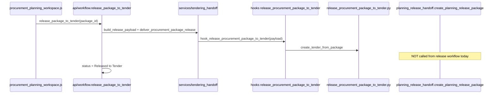

# Procurement Planning v2 — P0 Repository Inventory and Mapping

## Goal

Produce an evidence-backed Phase 0 gate before PP2 implementation. This document records what exists in the repository today, maps v2 requirements to concrete paths, documents reuse/patch/create decisions, flags deviations for human approval, and captures verification command output.

**P0 scope:** Read-only inventory. No application code was changed during P0.

**Site used for verification:** `kentender.midas.com`

**Inventory date:** 2026-05-24

**Governing tracker:** [3. procurement_planning_v_2_implementation_tracker.md](3.%20procurement_planning_v_2_implementation_tracker.md)

---

## 1. P0-001 — Repository Inventory

### 1.1 App namespace and bench layout

| Item | Path / value |
|------|----------------|
| Container repo | `apps/kentender_v1/` |
| Frappe app (canonical bench install) | `apps/kentender_procurement/` → symlink to `apps/kentender_v1/kentender_procurement/` |
| Planning module root | `kentender_procurement/kentender_procurement/procurement_planning/` (82 files) |
| Cross-module lifecycle | `kentender_procurement/kentender_procurement/procurement_lifecycle/` |
| Tender Management | `kentender_procurement/kentender_procurement/tender_management/` |
| Demand Intake | `kentender_procurement/kentender_procurement/demand_intake/` |
| Budget | `kentender_budget/kentender_budget/` |
| Strategy | `kentender_strategy/kentender_strategy/` |
| Core (module registry, seeds) | `kentender_core/kentender_core/` |
| UI tests | `apps/kentender_v1/tests/ui/` |
| PP2 spec pack | `apps/kentender_v1/docs/prompts/procurement planning v2/` |

### 1.2 UI framework

| Aspect | Finding |
|--------|---------|
| Framework | Frappe Desk **Workspace** shell + custom JS via **`app_include_js`** (not `page_js`, not React/Vue SPA) |
| Primary workbench JS | `kentender_procurement/kentender_procurement/public/js/procurement_planning_workspace.js` |
| CSS | `kentender_procurement/kentender_procurement/public/css/procurement_planning_workspace.css` |
| Template selector | `kentender_procurement/kentender_procurement/public/js/pp_template_selector.js` |
| List scroll helper | `kentender_procurement/kentender_procurement/public/js/workspace_list_selection_utils.js` |
| DocType form (escape hatch) | `kentender_procurement/kentender_procurement/public/js/procurement_package.js` |
| Workspace JSON (empty shell) | `kentender_procurement/kentender_procurement/kentender_procurement/workspace/procurement_planning/procurement_planning.json` |
| Hooks registration | `kentender_procurement/kentender_procurement/hooks.py` — `app_include_js`, `app_include_css`, `doctype_js`, permissions, `release_procurement_package_to_tender` hook |
| Module registry | `kentender_core/kentender_core/module_registry.py`, `kentender_core/kentender_core/public/js/kt_module_registry.js` — `procurement_planning` entry with `workspaceRoute`, `stateKey: kt_pp_workbench_state` |

### 1.3 DocTypes (planning-owned)

| DocType | JSON path |
|---------|-----------|
| Procurement Plan | `procurement_planning/doctype/procurement_plan/procurement_plan.json` |
| Procurement Package | `procurement_planning/doctype/procurement_package/procurement_package.json` |
| Procurement Package Line | `procurement_planning/doctype/procurement_package_line/procurement_package_line.json` |
| Procurement Template | `procurement_planning/doctype/procurement_template/procurement_template.json` |
| Risk Profile | `procurement_planning/doctype/risk_profile/risk_profile.json` |
| KPI Profile | `procurement_planning/doctype/kpi_profile/kpi_profile.json` |
| Decision Criteria Profile | `procurement_planning/doctype/decision_criteria_profile/decision_criteria_profile.json` |
| Vendor Management Profile | `procurement_planning/doctype/vendor_management_profile/vendor_management_profile.json` |

### 1.4 Services and root helpers

| File | Key exports |
|------|-------------|
| `services/template_application.py` | `apply_template_to_demands` |
| `services/template_applicability.py` | `validate_demands_for_template` |
| `services/planning_references.py` | `resolve_procurement_plan_name`, `resolve_procurement_template_name`, `resolve_demand_name` |
| `services/package_completeness.py` | `get_package_completeness_blockers`, `is_package_complete` |
| `services/tendering_handoff.py` | `build_release_payload`, `deliver_procurement_package_release` |
| `services/pp_governance_codes.py` | `PlanSubmit`, `PackageRelease` error codes |
| `pp_package_business_readiness.py` | `summarize_pp_package_business_readiness`, `CHECK_ORDER` |
| `package_planning_release_display.py` | PKGREL handoff display for list/detail APIs |
| `package_journey_surfaces.py` | `journey_link_hints_by_package_codes` |

### 1.5 Whitelisted APIs

| Module | Methods |
|--------|---------|
| `api/workflow.py` | `submit_plan`, `approve_plan`, `return_plan`, `reject_plan`, `lock_plan`, `complete_package`, `submit_package`, `approve_package`, `return_package`, `reject_package`, `apply_template_to_demands`, `mark_ready_for_tender`, `release_package_to_tender` |
| `api/landing.py` | `get_pp_landing_shell_data` |
| `api/package_list.py` | `get_pp_package_list` |
| `api/package_detail.py` | `get_pp_package_detail` |
| `api/package_line_edit.py` | `get_pp_package_lines`, `list_pp_assignable_demands`, `add_pp_package_line`, `remove_pp_package_line` |
| `api/template_selector.py` | `list_pp_templates`, `get_pp_template_preview` |
| `api/reference_search.py` | Link search hooks for plan, template, profiles |

### 1.6 Permissions

| File | Role |
|------|------|
| `permissions/pp_policy.py` | Action guards: Planner, Planning Authority, Procurement Officer |
| `permissions/pp_record_permissions.py` | DocType-level query conditions and `has_permission` for Plan and Package |

**Roles in `pp_policy.py` today:** `Procurement Planner`, `Planning Authority`, `Procurement Officer`, `Administrator`, `System Manager`. **Planning Reviewer is absent.**

### 1.7 Audit / evidence

| Mechanism | Path |
|-----------|------|
| Workflow audit comments | `_audit()` in `api/workflow.py` |
| Lifecycle handoff cards | `procurement_lifecycle/handoff_card_service.py` |
| Journey steps | `procurement_lifecycle/demand_planning_status.py`, `api/journey_api.py` |
| PKGREL creation service | `procurement_lifecycle/planning_release_handoff.py` — `create_planning_release_package` |

---

## 2. P0-002 — Existing Planning Object Map

| PP2 concept | v1 / repo object | Business code field | v2 gap |
|-------------|------------------|---------------------|--------|
| Procurement Plan | `Procurement Plan` DocType | `plan_code` | Plan states differ (v1: Draft/Submitted/Approved/Locked; v2: Draft/Active/Closed/Cancelled/Superseded) |
| Planning Inclusion | `Procurement Handoff Card` (lifecycle) | `handoff_code` e.g. `PLANINCL-MOH-2026-001` | Seeded only; no runtime `include_demand_in_procurement_plan` service |
| Procurement Package | `Procurement Package` DocType | `package_code` | State enum mismatch; no `Consumed by Tender Management`; no `planning_inclusion_code` link field |
| Package Line | `Procurement Package Line` DocType | `package_line_code` | Has `demand_id`, `budget_line_id` — **reuse** with P2 uniqueness guards |
| Method Decision | Fields on Package + Template | N/A (no `METHDEC-*` record) | Must persist decision record in P1/P2 |
| Readiness Result | Computed aggregate | N/A (no `PKGRDY-*` record) | `pp_package_business_readiness.py` — must persist in P1/P2 |
| Review Decision | Workflow audit only | N/A (no `PKGREV-*` record) | Must formalize on approve/return in P2 |
| Planning Release Package | Handoff card + display layer | `PKGREL-MOH-2026-001` via `planning_release_handoff.py` | Service exists; **not wired** to `release_package_to_tender` |
| Consumption Record | Missing | N/A | **CREATE** `PKGCONSUME-*` in P1 |
| Planning Template | `Procurement Template` DocType | template codes | **Reuse** |
| Profile DocTypes | Risk/KPI/Decision/Vendor | profile codes | **Reuse** |

### v1 package status options (found)

```
Draft | Completed | Submitted | Approved | Ready for Tender | Released to Tender | Returned | Rejected
```

File: `procurement_planning/doctype/procurement_package/procurement_package.json`

### v1 plan status options (found)

```
Draft | Submitted | Approved | Locked | Rejected | Returned
```

File: `procurement_planning/doctype/procurement_plan/procurement_plan.json`

---

## 3. P0-003 — Upstream Object Map

| PP2 reference | Owning module | DocType / service | Seed path |
|---------------|---------------|-------------------|-----------|
| `DEM-MOH-2026-001` | demand_intake | `Demand` | `demand_intake/seeds/works_master_demand_seed.py` |
| `DEMITEM-MOH-2026-001-001` | demand_intake | `Demand Item` (child) | same |
| `DEMAPP-MOH-2026-001` | procurement_lifecycle | Handoff card via `demand_approval_handoff.py` | `procurement_lifecycle/seeds/works_master_handoff_payloads.py` |
| `BUD-MOH-INFRA-2026-001` | kentender_budget | `Budget Line` | `kentender_budget/seeds/works_master_budget_seed.py` |
| `BUDCONF-MOH-2026-001` | procurement_lifecycle | Handoff card via `budget_funding_handoff.py` | handoff payloads |
| `OBJ-MOH-HOSP-RENOV` | kentender_strategy | Strategy hierarchy | `kentender_strategy/seeds/works_master_strategy_hierarchy.py` |
| `JRN-MOH-2026-001` | procurement_lifecycle | `Procurement Journey` | `procurement_lifecycle/seeds/works_master_journey_seed.py` |
| Approved demand queue (DIA) | demand_intake | `api/queue_list.py` — `approved_not_planned`, `planning_ready` | N/A |
| Planning readiness gate | demand_intake | `services/readiness.py`, `api/lifecycle.py` — `mark_planning_ready` | N/A |
| Demand planning status | procurement_lifecycle | `demand_planning_status.py` | N/A |

**Gap:** No Planning-side `get_approved_demands_awaiting_planning` API. DIA queue logic exists upstream only.

---

## 4. P0-004 — Tender Consumption Map

### Current release flow



| Step | File | Function |
|------|------|----------|
| Release API | `procurement_planning/api/workflow.py` | `release_package_to_tender` |
| Payload builder | `procurement_planning/services/tendering_handoff.py` | `build_release_payload`, `deliver_procurement_package_release` |
| Hook registration | `hooks.py` | `release_procurement_package_to_tender` |
| TM2 consumer | `tender_management/services/release_procurement_package_to_tender.py` | `hook_release_procurement_package_to_tender`, `create_tender_from_package` |
| Tender existence check | same | `package_has_release_tender` |
| PKGREL service (unused in release) | `procurement_lifecycle/planning_release_handoff.py` | `create_planning_release_package` |
| PKGREL display | `procurement_planning/package_planning_release_display.py` | reads handoff cards for list/detail APIs |
| WORKS tender seed | `tender_management/seeds/works_master_tender_seed.py` | `TND-MOH-2026-001` |

### PP2 consumption gap

- **`PKGCONSUME-MOH-2026-001`** — no code references outside PP2 docs.
- **`mark_planning_release_consumed`** — not implemented; TM2 hook implicitly consumes by creating tender.
- Package never transitions to **`Consumed by Tender Management`** state.

### Proposed P2 wiring (for human approval)

1. Call `create_planning_release_package` from `release_package_to_tender` before/alongside TM2 hook.
2. Add consumption record service called from TM2 hook after `create_tender_from_package`.
3. Transition package status to `Consumed by Tender Management` when consumption recorded.

---

## 5. P0-005 — UI Route and Navigation Map

### v1 (implemented)

| Surface | Route | Selector root | Nav |
|---------|-------|---------------|-----|
| Combined workbench | `/app/procurement-planning` | `pp-page-title`, `pp-tab-*`, `pp-row-*` | Single Workspace sidebar link "Procurement Planning" |
| Package form escape | `Form/Procurement Package/<name>` | Frappe form | DocType route |

Sidebar configs:
- `workspace_sidebar/procurement.json` — link to Procurement Planning workspace
- `workspace_sidebar/planning_module_navigation.json` — Procurement Home, DIA, Procurement Planning

### v2 (spec only — not implemented)

| Surface | Spec route | Spec selector | Nav treatment |
|---------|------------|---------------|---------------|
| Planning Home | `/desk/procurement-planning` | `pp2-planning-home` | Persistent sidebar |
| Approved Demands | `/desk/procurement-planning/approved-demands` | `pp2-approved-demands-page` | Persistent sidebar |
| Packages | `/desk/procurement-planning/packages` | `pp2-package-workbench` | Persistent sidebar |
| Released to Tender | `/desk/procurement-planning/releases` | `pp2-released-to-tender-page` | Persistent sidebar |
| Planning Evidence | `/desk/procurement-planning/evidence` | `pp2-planning-evidence-index` | Persistent sidebar |
| Package Workspace | `/desk/procurement-planning/packages/<code>` | `pp2-package-workspace` | Contextual (tabs) |
| Planning Release view | `/desk/procurement-planning/releases/<code>` | `pp2-release-package-page` | Contextual |

**Workspace pattern lock:** DIA/Budget/Strategy use `tests/ui/helpers/workspacePatternContract.ts`. Procurement Planning has **no** pattern-lock Playwright spec. Partial scroll preservation via `KTWorkspaceListSelection`.

---

## 6. P0-006 — Seed Inventory and Conflicts

| Seed | Entry point | Scope | PP2 conflict |
|------|-------------|-------|--------------|
| F1 baseline | `seeds/seed_procurement_planning_f1.py` | Generic profiles/templates/plan | Non-master; keep as secondary |
| PP3 slice | `seeds/seed_planning_pp3_slice.py` | Partial chain | Non-master |
| WORKS master (v1) | `seeds/works_master_planning_seed.py` | PLAN/PKG/PKGLINE; status via `db.set_value` bypass | **Conflicts with PP2** — bypasses guards; no checkpoints; no PLANINCL/METHDEC/PKGRDY/PKGREV/PKGCONSUME |
| WORKS S01 | `seeds/seed_works_stdint_s01.py` | Full workflow through release hook | Useful reference; not PP2 checkpoint loader |
| Lifecycle orchestrator | `procurement_lifecycle/seeds/seed_procurement_lifecycle_works_master.py` | JRN + 7 handoff cards | **Reuse** for cross-module validation |
| PP2 spec loader | **Missing** | Expected: `seed_procurement_planning_works_master(checkpoint=…)` | **CREATE** in P3 |

### PP2 checkpoints (spec — not in code)

`APPROVED_DEMAND_READY` → `INCLUDED_IN_PLAN` → `PACKAGE_DRAFT` → `READY_FOR_RELEASE` → `RELEASED_TO_TENDER` → `CONSUMED_BY_TENDER`

Default master checkpoint: `CONSUMED_BY_TENDER`

### Seed conflict summary

| Issue | v1 behavior | PP2 requirement |
|-------|-------------|-----------------|
| Guard bypass | `frappe.db.set_value` for status promotion | Real transitions or documented controlled bypass per checkpoint |
| PLANINCL | Lifecycle handoff seed only | Explicit inclusion at `INCLUDED_IN_PLAN` checkpoint |
| PKGREL runtime | Seeded; not created on release | Created by `release_package_to_tender` |
| PKGCONSUME | Absent | Required at `CONSUMED_BY_TENDER` |

---

## 7. P0-007 — Test Inventory and Verification Evidence

### Python tests (24 files under `procurement_planning/tests/`)

| File | Focus |
|------|-------|
| `test_f1_procurement_planning_seed.py` | F1 seed |
| `test_c4_pp3_slice.py` | PP3 slice |
| `test_r2_007_works_master_planning_seed.py` | WORKS master planning seed |
| `test_seed_works_stdint_s01_c1.py` … `c6.py` | WORKS S01 segments |
| `test_procurement_planning_smoke_g1.py` | G1 smoke (landing, list, detail, workflow) |
| `test_procurement_planning_h3_plan_bootstrap.py` | H3 plan bootstrap |
| `test_procurement_planning_testids_g2.py` | G2 UI testid contract (`pp-*`) |
| `test_procurement_template_default_std_b2.py` | B2 template ↔ STD |
| `test_pp_governance_spec.py` | Governance / workflow |
| `test_pp_builder_ux_regression.py` | Builder UX |
| `test_pp_permissions_e1.py` | E1 permissions |
| `test_pp_package_list.py` | Package list API |
| `test_pp_package_detail.py` | Package detail API |
| `test_pp_package_line_edit.py` | Package line CRUD |
| `test_pp_template_selector.py` | Template list/preview |
| `test_r5_005_package_journey_linkage.py` | Journey linkage |
| `test_r5_006_planning_release_handoff_display.py` | PKGREL display in APIs |
| `test_r5_007_pp_package_business_readiness.py` | Business readiness checklist |

### Playwright tests

| File | Scope |
|------|-------|
| `apps/kentender_v1/tests/ui/smoke/procurement/ui-smoke-rel-1610.spec.ts` | v1 release-to-tender smoke (`pp-*` testids) |
| `apps/kentender_v1/tests/ui/smoke/dia/dia-planning-readiness-panel.spec.ts` | DIA planning panel (adjacent) |

**Missing:** `procurement_planning_v2_*.spec.ts`, workspace pattern contract for Planning.

### Verification commands run (2026-05-24)

#### Command 1 — WORKS planning seed (v1)

```bash
bench --site kentender.midas.com execute \
  kentender_procurement.procurement_planning.seeds.works_master_planning_seed.upsert_works_master_planning
```

**Result:** PASS (idempotent)

```json
{"ok": true, "idempotent": true, "plan": "PLAN-MOH-2026", "plan_code": "PLAN-MOH-2026", "package": "PKG-MOH-2026-001", "package_code": "PKG-MOH-2026-001", "plan_status": "Approved", "package_status": "Released to Tender"}
```

#### Command 2 — Lifecycle WORKS master validation

```bash
bench --site kentender.midas.com execute \
  kentender_procurement.procurement_lifecycle.seeds.seed_procurement_lifecycle_works_master.validate_procurement_lifecycle_works_master_seed
```

**Result:** PASS — 22/22 checks at checkpoint `TENDER_PUBLISHED`

#### Command 3 — Key planning test modules

```bash
bench --site kentender.midas.com run-tests --app kentender_procurement \
  --module kentender_procurement.procurement_planning.tests.<module>
```

| Module | Result | Notes |
|--------|--------|-------|
| `test_r5_006_planning_release_handoff_display` | **OK** (3/3) | PKGREL display APIs |
| `test_procurement_planning_smoke_g1` | **OK** (13 skipped, 1 run) | G1 smoke |
| `test_f1_procurement_planning_seed` | **OK** (2 skipped) | F1 seed |
| `test_r2_007_works_master_planning_seed` | **FAILED** (1/6) | `test_001` expects fresh create but seed is idempotent on site |
| `test_pp_governance_spec` | **FAILED** (1/2) | `test_completeness_blockers_without_lines` — Decision Criteria Profile validation on insert |

**Note:** Full suite discovery requires `--app kentender_procurement --module kentender_procurement.procurement_planning.tests.<file>` per module. Bare `--module kentender_procurement.procurement_planning` discovers zero tests in this bench configuration.

#### Command 4 — Playwright v1 smoke

```bash
cd apps/kentender_v1 && npx playwright test tests/ui/smoke/procurement/ui-smoke-rel-1610.spec.ts
```

**Result:** PASS — 2/2 tests (12.7s)

---

## 8. P0-008 — Reuse / Patch / Create Decisions

| Required concept | Decision | Primary files to change (P1+) | Files not to change |
|-----------------|----------|------------------------------|---------------------|
| Approved Demand queue | **PATCH** — new Planning service/API | New `services/approved_demand_queue.py`, `api/approved_demands.py` | DIA `queue_list.py` (reuse filter logic only) |
| Procurement Plan | **PATCH** — align plan states | `doctype/procurement_plan/` | Strategy/Budget DocTypes |
| Planning Inclusion | **PATCH** — handoff card + inclusion service | `procurement_lifecycle/handoff_card_service.py`, new inclusion service | Do not mutate Demand |
| Procurement Package | **PATCH** — v2 states, lock fields, inclusion link | `doctype/procurement_package/` | TM2 Tender DocType |
| Package Line | **REUSE** — add P2 guards | `doctype/procurement_package_line/`, `api/package_line_edit.py` | Demand Item schema |
| Method Decision | **PATCH** — persist METHDEC record | Package DocType or child table + service | Template DocType (reuse) |
| Readiness Result | **PATCH** — persist PKGRDY | Extend `pp_package_business_readiness.py` | Keep CHECK_ORDER |
| Review Decision | **PATCH** — persist PKGREV | `api/workflow.py` | — |
| Planning Release Package | **PATCH** — wire to release | `api/workflow.py`, `planning_release_handoff.py` | Handoff card DocType (reuse) |
| Consumption Record | **CREATE** | New service under planning or lifecycle | TM2 creation logic (hook only) |
| Planning audit events | **PATCH** | `api/workflow.py`, lifecycle evidence | — |
| Five persistent UI surfaces | **REPLACE** | New workspace JS + sidebar fixtures | Keep v1 workbench until cutover |
| Package Workspace tabs | **PATCH/REPLACE** | `procurement_planning_workspace.js` or new v2 module | — |
| PP2 seed loader | **PATCH** — new checkpoint loader | `seeds/seed_procurement_planning_works_master.py` (new) | Keep v1 seeds as legacy |
| Planning Reviewer role | **CREATE** | `kentender_core/seeds/constants.py`, `pp_policy.py`, Role fixtures | — |
| Playwright v2 smoke | **CREATE** (P5/P8) | `tests/ui/smoke/procurement/procurement_planning_v2_*.spec.ts` | — |

**Approval needed:** No TBD cells remain. All concepts have a documented decision.

---

## 9. P0-009 — Deviation Report

### DEV-001 — Package state model mismatch

| | |
|---|---|
| **Expected (PP2)** | Draft → In Review → Returned for Correction → Approved → Ready for Release → Released to Tender → Consumed by Tender Management → Superseded / Cancelled |
| **Found** | Draft → Completed → Submitted → Approved → Ready for Tender → Released to Tender (+ Returned/Rejected) |
| **Options** | **A (recommended):** Migrate `Procurement Package.status` to PP2 enum; map Completed/Submitted → In Review; Ready for Tender → Ready for Release; add Consumed by Tender Management. **B:** Keep v1 states; map via `planning_status` auxiliary field. **C:** Dual-write v2 field during transition. |
| **Recommended** | Option A |
| **Impact** | P1 schema, workflow.py, all transition tests, UI badges, seed loaders |
| **Requires approval** | Yes |

### DEV-002 — Planning Inclusion shape

| | |
|---|---|
| **Expected** | Explicit `PLANINCL-*` (PP2-DEC-001: real object if feasible) |
| **Found** | `Procurement Handoff Card` with title "Planning Inclusion Record" — seeded, not workflow-created |
| **Options** | **A (recommended):** Formal handoff record via `handoff_card_service.py` + `create_planning_inclusion` service with domain-model fields. **B:** New `Planning Inclusion Record` DocType. |
| **Recommended** | Option A |
| **Impact** | P1 Include-in-Plan API, seed checkpoints |
| **Requires approval** | Yes |

### DEV-003 — Release does not create PKGREL at runtime

| | |
|---|---|
| **Expected** | `release_package_to_tender` creates Planning Release Package |
| **Found** | Release calls TM2 hook only; PKGREL from seeds/tests via `create_planning_release_package` |
| **Recommended** | Wire `create_planning_release_package` into release workflow (P2 scope — not a deviation if approved) |
| **Requires approval** | Confirm as P2 requirement |

### DEV-004 — Readiness computed, not persisted

| | |
|---|---|
| **Expected** | Persisted `PKGRDY-*` with stale/current flags |
| **Found** | `summarize_pp_package_business_readiness()` live aggregate |
| **Recommended** | PATCH — persistence layer reusing CHECK_ORDER |
| **Requires approval** | No (aligns with spec supporting-record pattern) |

### DEV-005 — UI navigation architecture

| | |
|---|---|
| **Expected** | Five persistent sidebar surfaces + contextual package workspace |
| **Found** | One Workspace + global `app_include_js` workbench |
| **Recommended** | REPLACE following DIA/Budget/Strategy workspace pattern; P5 effort |
| **Requires approval** | No (spec is explicit) |

### DEV-006 — Seed guard bypass

| | |
|---|---|
| **Found** | `works_master_planning_seed.py` uses `frappe.db.set_value` to bypass lifecycle guards |
| **Expected** | PP2 seed proves real transitions at checkpoints |
| **Recommended** | New PP2 loader uses services; v1 seed remains legacy/non-master |
| **Requires approval** | No |

### No other deviations found

Repository structure is compatible with PP2 implementation path. No STOP-condition blockers beyond DEV-001 and DEV-002 requiring human choice before P1 schema work.

---

## 10. P0 Exit Criteria Checklist

| Criterion | Status |
|-----------|--------|
| Inventory complete with concrete paths | **Done** — this document |
| Reuse/patch/create decisions documented | **Done** — §8 |
| Deviations DEV-001–006 reported | **Done** — §9 |
| No application code changed during P0 | **Done** |
| Verification commands recorded | **Done** — §7 |
| Human reviewer approved implementation path (P0-010) | **Pending** — see §11 |

---

## 11. P0-010 — Human Review Decision

**Decision date:** 2026-05-24  
**Status:** **Accepted** (with binding implementation posture below)

### Human decisions (recorded)

| Question | Decision |
|----------|----------|
| **DEV-001 — Package state model** | **Replace in-place; no migration.** Adopt PP2 state enum on `Procurement Package.status` directly. Remove v1-only states (`Completed`, `Submitted`, `Ready for Tender`, etc.) and all code/tests/seeds that depend on them. Do not dual-write or use auxiliary `planning_status` mapping. |
| **DEV-002 — Planning Inclusion shape** | **Option A — Handoff Card + service.** Use `Procurement Handoff Card` via `handoff_card_service.py` + `create_planning_inclusion` service. No separate Planning Inclusion DocType unless a later blocker forces it. |
| **DEV-003 — PKGREL on release** | **Wire `create_planning_release_package` into release workflow** (P2 scope). |
| **P1 scope — patch vs parallel fields** | **In-place patches on existing DocTypes.** No parallel v2 fields, no migration layer. |
| **Data strategy (overrides all above)** | **Dev environment posture:** aggressively remove artefacts that conflict with PP2 architecture. **Delete all conflicting data where necessary and reseed** from WORKS master loaders. No production-style migration scripts. |

### Binding implementation posture for P1+

```text
1. Change schema and code to match PP2 spec directly.
2. Delete or rewrite v1-only states, APIs, UI paths, seeds, and tests that conflict.
3. Reseed via PP2 checkpoint loader (and lifecycle WORKS master) after destructive clears.
4. Do not preserve backward compatibility with v1 Planning semantics.
```

### P0 gate result

**P0-010 Accepted.** P1 may begin when explicitly triggered for implementation.

**Accepted by:** Product owner (conversation decision 2026-05-24)  
**Conditions:** Reseed-after-delete is mandatory when schema/state changes invalidate existing rows.

---

## 12. Cross-Module Regression Baseline (for P7)

Commands to record when P7 begins (not run in P0):

```bash
bench --site kentender.midas.com run-tests --app kentender_procurement --module kentender_procurement.demand_intake.tests
bench --site kentender.midas.com run-tests --app kentender_budget --module kentender_budget.tests
bench --site kentender.midas.com run-tests --app kentender_procurement --module kentender_procurement.procurement_lifecycle.tests
bench --site kentender.midas.com run-tests --app kentender_procurement --module kentender_procurement.tender_management.tests
```

---

END OF P0 INVENTORY
