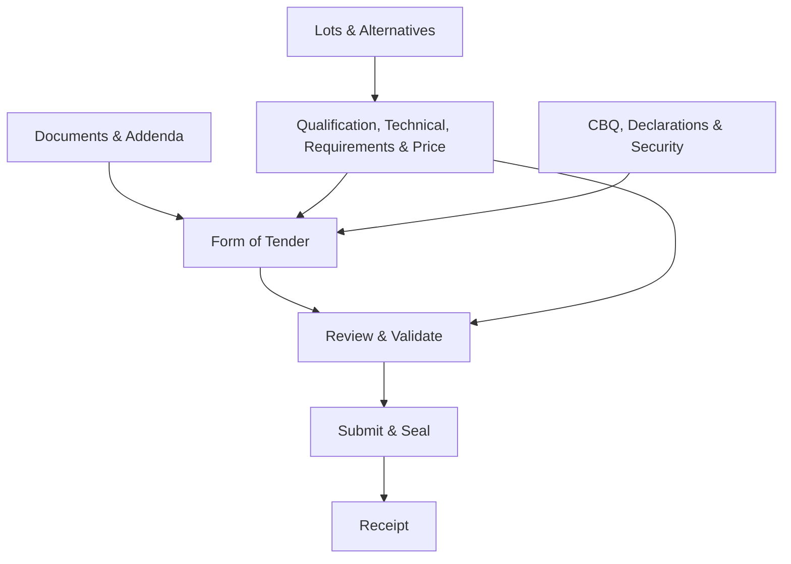

# KenTender e-Procurement System

# Canonical PPRA IT STD - Bidder Submission Section Blueprint v1

| Item | Value |
|---|---|
| Project | KenTender e-Procurement System |
| Module family | Standard Tender Document Engine / Bidder Workspace |
| Artifact | Canonical bidder-submission section blueprint |
| Canonical STD family | Procurement of Information Technology |
| Primary legal source | PPRA Standard Tender Document for Procurement of Information Technology, DOC. 10 |
| Upstream control | `Canonical PPRA IT STD - Bidder Submission Obligation Catalogue v1` |
| Working seed-package reference | `KE-PPRA-IT-2022-04` |
| Calibration fixture | NSSF SPS ERP Tender, Ref. `NSSFSPS/ICT/ERP/001/2025-2026` |
| Status | Recovery baseline for review and approval |
| Version | 1.0 |
| Governing rule | The blueprint groups approved canonical obligations. It does not derive legal requirements from a tender fixture, document page order, screen mock-up, or implementation schema. |

---

## 1. Purpose

This blueprint defines how the approved bidder-submission obligations of the PPRA Information Technology Standard Tender Document are converted into coherent bidder-facing sections.

It is the controlled layer between:

```text
Canonical PPRA IT STD - Bidder Submission Obligation Catalogue
and
Tender-specific Bidder Workspace Manifest
```

The blueprint answers:

> How must the canonical obligations be grouped, ordered, rendered, completed, invalidated, and routed so that a bidder can prepare and submit one legally complete electronic bid?

It establishes:

- a fixed workspace shell;
- stable section identities;
- standard and conditional section templates;
- section order and grouping;
- obligation ownership;
- renderer contracts;
- section dependencies;
- derived completion rules;
- role permissions;
- evidence reuse;
- issue projection;
- addendum invalidation;
- opening, evaluation, and contract routing;
- the expected NSSF calibration output; and
- the minimum contract for the later manifest compiler.

This is a product and domain-control artifact. It is not:

- a screen mock-up;
- a Stitch prompt;
- a database schema;
- an API specification;
- a Cursor implementation prompt; or
- a substitute for the approved PPRA IT STD.

---

## 2. Binding Control Decision

The bidder checklist must be compiled from canonical sources. It must not be manually authored for each tender.

The binding derivation chain is:

```text
Approved PPRA IT STD Version
-> Approved Bidder Submission Obligation Catalogue
-> Approved Bidder Submission Section Blueprint
-> Approved Tender Configuration Snapshot
-> Compiled and Versioned Bidder Workspace Manifest
-> Bidder Response Instances
-> Sealed Bid Submission
```

The following decisions are binding:

1. The PPRA IT STD defines the canonical bidder obligations.
2. The obligation catalogue gives those obligations stable identities and rules.
3. This blueprint groups those obligations into bidder tasks.
4. The approved tender configuration supplies permitted tender-specific values and collections.
5. The manifest compiler resolves applicability, titles, rows, dependencies, and validation for one published tender.
6. The Bidder Workspace renders only the compiled manifest.
7. The NSSF tender is a calibration fixture and generated test case only.
8. A PDF or word-processing document is not the electronic completion surface.
9. A checklist row is a bidder task, not a reproduction of a printed document heading.
10. Review, submission, sealing, and receipt are workflow gates, not ordinary content sections.

The earlier NSSF-specific schema and checklist are therefore recoverable test inputs, not the canonical target model.

---

## 3. Source Authority and Precedence

### 3.1 Authority order

| Priority | Source | Authority |
|---:|---|---|
| 1 | Bound approved PPRA IT STD version | Legal text, form structure, allowed conditions, and canonical source rules |
| 2 | Approved bidder-submission obligation catalogue | Complete obligation inventory, stable IDs, and source-to-obligation controls |
| 3 | Approved section blueprint | Section ownership, order, renderer, dependency, and completion patterns |
| 4 | Approved and published tender configuration snapshot | Tender-specific values, criteria, requirements, evidence, schedules, lots, and price rows |
| 5 | Approved electronic-submission policy | Governed electronic equivalents for paper submission mechanics |
| 6 | Compiled bidder workspace manifest | Reproducible tender-specific output |
| 7 | Calibration fixture | Test data and validation evidence only |

### 3.2 Conflict rule

If a fixture, extraction, mock-up, or generated schema conflicts with the bound PPRA IT STD:

1. preserve the source artifact as evidence;
2. record the discrepancy;
3. apply the approved canonical obligation and blueprint;
4. remap the fixture data into permitted configuration slots;
5. recompile the bidder workspace manifest; and
6. invalidate any test expectation based on the incorrect structure.

### 3.3 No page-driven behavior

Printed pages and rendered PDFs may be retained as provenance and bidder reference material. They must not:

- determine section identity;
- determine checklist order;
- create response fields;
- be the only requirement identifier;
- require a bidder to reproduce an electronic response in an uploaded form; or
- create a hidden obligation outside the approved catalogue.

---

## 4. Scope and Boundaries

### 4.1 Included

This blueprint controls:

- bidder-facing content sections;
- conditional section generation;
- section labels and order;
- task groups within sections;
- obligation-to-section ownership;
- reusable section renderers;
- response and evidence relationships;
- section and row statuses;
- blocking and non-blocking issue projection;
- dependency and invalidation rules;
- roles and controlled confirmations;
- whole-workspace gates;
- downstream route metadata; and
- NSSF recovery and calibration expectations.

### 4.2 Excluded

This blueprint does not define:

- procurement-entity tender-authoring screens;
- physical document layout;
- visual styling;
- component-library tokens;
- database tables;
- API endpoints;
- encryption implementation;
- cryptographic algorithms;
- infrastructure deployment;
- evaluation scoring decisions;
- bid-opening permissions beyond required routing metadata;
- award decisions; or
- contract administration.

### 4.3 Electronic-only rule

The bidder completes the bid through structured electronic interactions.

An upload is used only when the obligation is genuinely evidentiary or requires a third-party instrument. It is not used to duplicate:

- the Form of Tender;
- the Confidential Business Questionnaire;
- statutory declarations;
- requirement responses;
- price schedules;
- implementation schedules;
- bidder identity already held in a verified profile; or
- platform confirmation and submission events.

---

## 5. Canonical Layer Model

| Layer | Owns | Must not own |
|---|---|---|
| STD Template Version | Locked legal text, standard forms, configuration slots, and canonical source anchors | Tender-specific values or bidder responses |
| Obligation Catalogue | Stable obligation identities, applicability, fulfilment, validation, and downstream classification | Screen order or tender-specific row instances |
| Section Blueprint | Stable section templates, obligation grouping, renderer contracts, dependencies, and completion patterns | Tender values, bidder responses, or runtime status |
| Tender Configuration Snapshot | Approved tender values, criteria, evidence demands, requirement rows, schedule rows, and price rows | Changes to canonical legal meaning |
| Bidder Workspace Manifest | Resolved section instances, task groups, fields, rows, rules, and version bindings | New obligations or runtime edits to canonical rules |
| Bid Workspace | Bidder responses, evidence links, drafts, issues, and derived status | Tender configuration or legal-text changes |
| Sealed Bid Submission | Immutable response snapshot, authorization, seal, timestamp, and receipt reference | Post-submission editing |

### 5.1 Key terms

| Term | Meaning |
|---|---|
| Section template | Approved reusable grouping and behavior defined by this blueprint |
| Section instance | Tender-specific manifestation of a section template in a compiled manifest |
| Task group | Coherent subsection of bidder work within a section |
| Task or row | Smallest independently validated bidder obligation instance |
| Cross-cutting view | Consolidated projection across sections; not a checklist section |
| Workflow gate | Whole-bid transition that operates on completed section content |
| Applicability | Whether a section, group, or task exists for the tender and bidder circumstances |
| Requiredness | Whether an applicable item must be complete |
| Blocker | An issue that prevents section completion or submission |
| Invalidation | System transition that makes a previously complete response or confirmation stale |

---

## 6. Governance and Lifecycle

### 6.1 Blueprint lifecycle

```text
Draft
-> Validated
-> Submitted for Approval
-> Approved
-> Active
-> Superseded or Retired
```

| State | Meaning | Permitted outcome |
|---|---|---|
| Draft | Section definitions are being authored | Edit and validate |
| Validated | Coverage and internal consistency checks have passed | Submit for approval |
| Submitted for Approval | Controlled approval is pending | Approve or return |
| Approved | Version is approved but not yet active | Activate |
| Active | Version may be bound to new tenders | Read-only |
| Superseded | Newer active version exists; prior bindings remain reproducible | Read-only |
| Retired | Version is unavailable for new tenders | Read-only |

### 6.2 Governance roles

| Capability | STD Template Administrator | Legal / Procurement Reviewer | STD Approver | Tender Configurator | Tender Reviewer | Manifest Compiler |
|---|---:|---:|---:|---:|---:|---:|
| Draft section templates | Yes | No | No | No | No | No |
| Assign obligation ownership | Yes | Review | No | No | No | Automated validation |
| Define renderer and completion pattern | Yes | Review | No | No | No | No |
| Validate legal coverage | Support | Yes | No | No | No | Automated checks |
| Approve blueprint version | No | Recommend | Yes | No | No | No |
| Activate blueprint version | Controlled | No | Yes | No | No | No |
| Configure tender-specific values | No | No | No | Yes | Review | No |
| Override an active template at runtime | No | No | No | No | No | No |
| Compile a manifest | No | No | No | No | No | Yes |

### 6.3 Immutability

An active blueprint version is immutable.

A change to any of the following requires a new blueprint version:

- section identity;
- section type;
- canonical title;
- obligation ownership;
- ordering rule;
- applicability rule;
- requiredness pattern;
- dependency rule;
- completion rule;
- invalidation rule;
- renderer contract;
- role permission;
- downstream route; or
- workflow-gate relationship.

Published tenders retain their original version bindings unless an approved addendum creates a new published tender version and manifest.

---

## 7. Fixed Bidder Workspace Shell

Every tender uses the same broad shell:

```text
Tender Overview
Tender Documents
Submission Checklist
Prepare Bid
Review & Validate
Submit & Seal Bid
Submission Receipt
```

| Shell destination | Purpose | Dynamic content |
|---|---|---|
| Tender Overview | Tender identity, scope, deadline, lot summary, and bidder workspace entry | Published tender summary |
| Tender Documents | Current tender package and addendum register | Published documents and acknowledgement state |
| Submission Checklist | Section progress, current issues, and next action | Compiled section instances |
| Prepare Bid | Electronic completion of one section at a time | Compiled renderer and task schema |
| Review & Validate | Whole-bid review and validation gate | Compiled review projection |
| Submit & Seal Bid | Authorized final submission transaction | Compiled submission policy |
| Submission Receipt | Immutable confirmation and verification details | Sealed submission record |

The shell is stable across STD families. The section set within `Prepare Bid` is generated by the STD-specific blueprint and tender configuration.

### 7.1 Tender Documents is not duplicated

`Tender Documents` in the shell is the document library destination.

`Tender Documents & Addenda` in the checklist is the bidder task that records required acknowledgements. Its action opens the same destination in acknowledgement mode. The system must not maintain two independent acknowledgement records.

---

## 8. Canonical Section Taxonomy

### 8.1 Standard IT bidder sections

The canonical IT STD blueprint contains nine standard section templates.

| Order | Section key | Canonical title | Section type | Default inclusion |
|---:|---|---|---|---|
| 100 | `tender_documents_and_addenda` | Tender Documents & Addenda | `document_acknowledgement` | Always |
| 200 | `form_of_tender` | Form of Tender | `declaration_form` | Always |
| 300 | `confidential_business_questionnaire` | Confidential Business Questionnaire | `questionnaire` | Always |
| 400 | `statutory_declarations` | Statutory Declarations | `declaration_bundle` | Always |
| 500 | `preliminary_requirements_and_evidence` | Preliminary Requirements & Evidence | `eligibility_checklist` | Always when applicable published criteria or additional evidence exist |
| 600 | `qualification_and_capability` | Qualification & Capability | `qualification_response` | Always when qualification obligations exist |
| 700 | `technical_proposal_and_implementation_plan` | Technical Proposal & Implementation Plan | `technical_response` | Always when technical proposal obligations exist |
| 800 | `requirements_compliance` | Requirements Compliance | `requirement_matrix` | Always when response-bearing requirement rows exist |
| 900 | `price_schedule` | Price Schedule | `price_schedule` | Always |

The order values are stable sort weights. They permit conditional sections to be inserted without renumbering canonical templates.

### 8.2 Conditional IT bidder sections

| Order | Section key | Canonical title | Section type | Inclusion rule |
|---:|---|---|---|---|
| 150 | `lot_and_alternative_selection` | Lots & Alternatives | `lot_selection` | Generate when bidders may choose lots or alternatives are permitted |
| 450 | `tender_security` | Tender Security | `security_instrument` | Generate when tender security or a tender-securing declaration is configured |

The compiler may resolve the displayed title of `tender_security` to `Tender-Securing Declaration` when that is the configured exclusive mode. The stable section key does not change.

### 8.3 Cross-cutting views

| View key | Title | Purpose |
|---|---|---|
| `evidence_register` | Evidence Register | Consolidate evidence owned or linked by all sections |
| `issue_register` | Issues | Consolidate blockers, warnings, and information across the workspace |

Cross-cutting views:

- do not appear as required checklist sections;
- do not have an independent completion status;
- do not create obligations;
- link back to the owning section, group, and task; and
- reflect the current manifest and response state.

### 8.4 Workflow gates

| Gate key | Title | Purpose |
|---|---|---|
| `review_and_validate` | Review & Validate | Run and present whole-bid validation |
| `submit_and_seal` | Submit & Seal Bid | Obtain authorized final confirmation and create the immutable submission |
| `submission_receipt` | Submission Receipt | Present the verifiable submission record |

Workflow gates are not content sections. They must not be numbered as checklist rows alongside bidder forms and matrices.

### 8.5 Prohibited canonical section names

The following names must not be hardcoded as universal IT STD section templates:

- `Technical Requirements`;
- `Technical Qualification`;
- `Mandatory Preliminary Documents`;
- `Implementation Plan and Delivery Methodology`;
- `Contract Conditions Acknowledgement`;
- `Final Declaration and Submission`; or
- any title containing a supplier, product, procuring entity, currency, tax rate, or fixture name.

Some of these labels may be resolved as tender-specific task-group titles when supported by the manifest. They are not canonical section identities.

---

## 9. Section Blueprint Record Contract

Every section template must contain the following logical attributes.

| Attribute | Requirement |
|---|---|
| `section_template_id` | Stable identifier unique within the blueprint version |
| `section_key` | Stable machine-readable key |
| `title` | Canonical bidder-facing title or approved title-resolution rule |
| `section_type` | Registered renderer type |
| `order_weight` | Stable ordering value |
| `source_std_family` | Bound canonical STD family |
| `obligation_selector` | Explicit obligation IDs, ranges, or governed selection rules |
| `applicability_rule` | Exact rule deciding whether the section or task exists |
| `requiredness_rule` | Exact rule deciding whether an applicable item is required |
| `blocks_submission` | Whether unresolved required items prevent submission |
| `task_groups` | Ordered groups of fields, rows, declarations, or evidence tasks |
| `dependencies` | Upstream sections, records, values, and version bindings |
| `completion_rule` | System-derived conditions for `Complete` |
| `invalidation_rules` | Changes that make prior responses or confirmations stale |
| `role_permissions` | View, edit, confirm, and restricted actions by bidder role |
| `renderer_contract` | Required response capabilities independent of visual styling |
| `validation_rules` | Field, row, group, section, and cross-section validation |
| `issue_projection` | How blockers, warnings, and information are presented |
| `opening_route` | Predetermined opening-register disclosure |
| `evaluation_route` | Preliminary, technical, financial, informational, or none |
| `contract_route` | No carry-forward, reference, or governed award carry-forward |
| `lifecycle_status` | Blueprint-record lifecycle state |
| `version` | Immutable record version |

### 9.1 Task-group record

Each task group must define:

| Attribute | Requirement |
|---|---|
| `group_key` | Stable within the section template |
| `title` | Bidder-facing group title |
| `order_weight` | Stable order within the section |
| `obligation_refs` | Obligations owned or projected in the group |
| `repeat_rule` | None, per lot, per alternative, per entity, per JV member, per subcontractor, or configured collection |
| `response_model` | Fields, rows, declarations, evidence links, or derived summary |
| `applicability_rule` | Tender-level or bidder-dependent rule |
| `requiredness_rule` | Rule for applicable group completion |
| `completion_rule` | Derived group completion |
| `issue_rule` | Validation and issue projection |

### 9.2 Obligation ownership rule

Every active bidder-facing obligation must have:

- exactly one primary owning section, workflow gate, or cross-cutting control;
- zero or more read-only cross-section projections;
- zero or more evidence links; and
- predetermined downstream routes.

A cross-reference does not transfer ownership. A criterion that checks completion of a Form of Tender declaration links to that declaration; it does not create a second upload or checkbox.

Post-award exclusions have one controlled exclusion disposition instead of a bidder-workspace owner.

### 9.3 Registered renderer types

| Renderer type | Core capability |
|---|---|
| `document_acknowledgement` | Current package display, addendum register, and version-bound acknowledgement |
| `lot_selection` | Lot selection and alternative-package coordination |
| `declaration_form` | Structured legal form, derived values, disclosures, and controlled confirmation |
| `questionnaire` | Entity-aware structured questionnaire with conditional ownership rows |
| `declaration_bundle` | Multiple separately governed declarations and signatory controls |
| `security_instrument` | Configured instrument or declaration with issuer and validity validation |
| `eligibility_checklist` | Criteria, response/evidence route, criterion status, and cross-links |
| `qualification_response` | Structured qualification forms, repeating records, and supporting evidence |
| `technical_response` | Narrative, structured plan, schedule, team, inventory, and evidence response |
| `requirement_matrix` | Grouped item-level compliance responses and evidence links |
| `price_schedule` | Structured price tables, calculation, totals, discounts, taxes, and currencies |

Renderer registration controls capability, not page composition or visual style.

---

## 10. Common Section Behavior

### 10.1 Required content

Every content section must present:

- manifest-resolved title;
- concise section instruction;
- section status;
- progress within the section;
- task groups and applicable tasks;
- current blockers and warnings;
- last saved time;
- actions to save, continue, and return to the workspace; and
- read-only source or dependency context where needed to complete the task.

### 10.2 Standard section actions

| Condition | Action |
|---|---|
| Section has never been opened | `Start` |
| Section contains valid saved work but is incomplete | `Continue` |
| Section has blockers | `Fix` |
| Section is complete | `Review` |
| Section is read-only in a sealed submission | `View` |

Within a content section, the standard actions are:

- `Save Section`;
- `Save & Continue`; and
- `Back to Workspace`.

Special actions are defined only where legally or transactionally required:

- `Confirm Form of Tender`;
- declaration-specific controlled confirmation;
- `Review & Validate`; and
- `Submit & Seal Bid`.

### 10.3 Status derivation

The bidder cannot manually set section status.

| Status | Derived meaning |
|---|---|
| Not Started | No material response or required acknowledgement has been saved |
| In Progress | At least one material response exists and completion conditions are not met |
| Needs Attention | At least one current blocker exists |
| Complete | All applicable required tasks are complete, dependencies are current, and no blocker exists |
| Not Applicable | A retained bidder-dependent task or historical task no longer applies under an approved rule |

At tender level, the compiler should omit a non-applicable section rather than render an empty `Not Applicable` checklist row. `Not Applicable` is reserved for:

- bidder-dependent tasks resolved after workspace creation;
- lot-specific or entity-specific rows;
- retained history after an addendum; or
- a legally required explicit non-applicability response.

### 10.4 Completion formula

A section is `Complete` only when:

```text
section is applicable
and every applicable required task group is complete
and every required response is valid
and every required evidence link resolves to a current valid evidence record
and every required confirmation is current
and every dependency snapshot is current
and no blocking issue remains
```

Completion is recalculated after every material change.

### 10.5 Issue severity

| Severity | Effect |
|---|---|
| Blocker | Prevents task, section, review, or submission completion |
| Warning | Requires attention but does not by itself block submission |
| Information | Explains a rule, dependency, or derived value |

Each issue must identify:

- stable issue code;
- severity;
- owning section;
- task group and task or row where applicable;
- concise message;
- corrective action;
- source rule;
- first detected time;
- current detection time; and
- resolved time when resolved.

### 10.6 Save behavior

- Save validates the affected response unit and cross-section dependencies that can be evaluated immediately.
- Saving must not imply legal confirmation.
- Autosave may preserve drafts, but only an explicit confirmation event may satisfy an authorized confirmation obligation.
- Concurrent edits must not silently overwrite a newer saved version.
- The section must show whether the displayed state is saved, stale, or read-only.

### 10.7 Dynamic labels

The manifest may resolve:

- tender title;
- lot labels;
- criterion groups;
- requirement groups;
- schedule names;
- price-table names;
- security-mode title; and
- tender-specific instructions.

It must not rename the stable section key or conceal the canonical legal nature of a section.

---

## 11. Section Template - Tender Documents & Addenda

### 11.1 Template identity

| Attribute | Value |
|---|---|
| `section_template_id` | `IT-BSS-IT-001` |
| `section_key` | `tender_documents_and_addenda` |
| Canonical title | Tender Documents & Addenda |
| `section_type` | `document_acknowledgement` |
| `order_weight` | `100` |
| Default applicability | Always |
| Default requiredness | Current required acknowledgements must be complete |
| `blocks_submission` | Yes |
| Primary obligations | `IT-BSO-DOC-001` through `IT-BSO-DOC-005` |

### 11.2 Purpose

Give the bidder one authoritative place to review the current tender package, issued addenda, and required acknowledgements.

The section is not a generic checkbox saying that every legal term has been accepted. Acceptance and declarations remain in the Form of Tender and other governed forms.

### 11.3 Task groups

| Order | Group key | Title | Content |
|---:|---|---|---|
| 100 | `current_tender_package` | Current Tender Package | Current confirmed document set, version, publication date, and digest |
| 200 | `addenda_register` | Addenda | Every current addendum, issue date, summary, and affected package version |
| 300 | `required_acknowledgements` | Required Acknowledgements | Version-bound acknowledgement tasks generated by policy |

### 11.4 Applicability and requiredness

- The section is always generated.
- A document or addendum acknowledgement is required only when the published policy marks it as required.
- An addendum issued after workspace creation is included automatically in the current manifest version.
- If no explicit acknowledgement is required, the section may derive `Complete` once the current package is available and no document-version blocker exists.
- A bidder may always open and download the current documents, regardless of completion status.

### 11.5 Dependencies and completion

Dependencies:

- published tender version;
- current document package version;
- addendum-set version;
- acknowledgement policy; and
- bidder organization/workspace identity.

The section is complete only when:

- the displayed package version equals the manifest package version;
- every acknowledgement required for that version is current;
- no superseded acknowledgement is counted; and
- no document-integrity issue exists.

### 11.6 Invalidation

Invalidate affected acknowledgements when:

- an addendum is issued;
- a document is replaced;
- the required-acknowledgement policy changes through an approved addendum;
- the manifest binds a new package digest; or
- an acknowledgement is proven to have been recorded against the wrong version.

The addendum impact set determines whether an acknowledgement, Form of Tender confirmation, or other section response must be repeated.

### 11.7 Renderer and routing

The renderer must support:

- current-versus-superseded document distinction;
- direct view and download;
- addendum chronology;
- acknowledgement by a permitted bidder user;
- recorded actor, time, package version, and digest; and
- clear indication of any acknowledgement made stale by an addendum.

Downstream routes:

- opening: no tender-content disclosure;
- evaluation: current acknowledgement status where the published evaluation model requires it;
- contract: no independent carry-forward; and
- audit: full version and acknowledgement history.

---

## 12. Conditional Section Template - Lots & Alternatives

### 12.1 Template identity

| Attribute | Value |
|---|---|
| `section_template_id` | `IT-BSS-IT-002` |
| `section_key` | `lot_and_alternative_selection` |
| Canonical title | Lots & Alternatives |
| `section_type` | `lot_selection` |
| `order_weight` | `150` |
| Default applicability | Conditional |
| Default requiredness | All required selection and alternative-identification tasks |
| `blocks_submission` | Yes when generated |
| Primary obligations | `IT-BSO-LOT-001` through `IT-BSO-LOT-003`; `IT-BSO-ALT-001` through `IT-BSO-ALT-004` |

### 12.2 Generation rule

Generate this section when either:

- the tender permits a bidder to select one or more lots; or
- the tender permits one or more alternative tenders.

Omit it when:

- there is one fixed scope or lot;
- all bidders must bid for the same fixed lot set; and
- alternatives are prohibited.

When a multi-lot scope is fixed and requires no bidder selection, lot-combination qualification and completeness rules compile directly into the dependent qualification, requirements, technical, and price sections without a visible coordinator section.

### 12.3 Task groups

| Order | Group key | Title | Repeat rule | Content |
|---:|---|---|---|---|
| 100 | `lot_selection` | Lots Included in This Bid | Per published lot | Selection, mandatory-lot rules, and combination constraints |
| 200 | `alternative_selection` | Alternative Tenders | Per selected lot or tender | Base-offer requirement, alternative identity, and scope |
| 300 | `selection_impact` | Required Responses | Derived | Sections, requirement groups, evidence, and price schedules generated by the selection |

### 12.4 Ownership boundary

This section owns:

- which permitted lots are included;
- which permitted alternatives the bidder will submit;
- alternative identity;
- base-offer dependency; and
- selection-driven applicability.

It does not own:

- detailed alternative technical responses;
- alternative implementation schedules;
- alternative evidence;
- alternative prices; or
- evaluation of lot combinations.

Those responses are completed in the technical, requirements, qualification, and price sections under the lot/alternative context coordinated here.

### 12.5 Completion and invalidation

The section is complete when:

- at least the minimum permitted lot selection is made;
- every forbidden combination is rejected;
- every alternative has a stable identity and permitted scope;
- a compliant base response exists where required; and
- the dependent section-instance set has been generated.

Changing lot or alternative selection invalidates:

- affected qualification aggregates;
- affected requirement responses;
- affected technical responses;
- affected schedules;
- affected evidence links;
- affected prices and discounts;
- derived Form of Tender amounts; and
- Form of Tender confirmation.

The system must warn before a selection change that would remove saved dependent responses. Removed response history remains auditable.

### 12.6 Routing

- opening: selected lots and permitted opening-level alternative identity, as configured;
- evaluation: lot combination, alternative eligibility, and all linked technical/financial responses;
- contract: awarded lot and accepted alternative only; and
- audit: selection and invalidation history.

---

## 13. Section Template - Form of Tender

### 13.1 Template identity

| Attribute | Value |
|---|---|
| `section_template_id` | `IT-BSS-IT-003` |
| `section_key` | `form_of_tender` |
| Canonical title | Form of Tender |
| `section_type` | `declaration_form` |
| `order_weight` | `200` |
| Default applicability | Always |
| Default requiredness | Full applicable canonical form and authorized confirmation |
| `blocks_submission` | Yes |
| Primary obligations | `IT-BSO-FOT-001` through `IT-BSO-FOT-024`; `IT-BSO-AUT-001` through `IT-BSO-AUT-002`; `IT-BSO-SPC-001` |

### 13.2 Purpose

Implement the complete canonical PPRA IT Form of Tender as a governed electronic form.

The section may be opened early so the bidder can review the legal commitments. It may remain `In Progress` until dependent sections are complete. Its early checklist position does not imply linear completion.

### 13.3 Task groups

| Order | Group key | Title | Main content |
|---:|---|---|---|
| 100 | `tender_and_bidder_details` | Tender and Bidder Details | Derived tender identity, bidder identity, lot/alternative context |
| 200 | `offer_and_price_summary` | Offer and Price Summary | Derived lot totals, currencies, discounts, taxes, and grand total |
| 300 | `declarations_and_disclosures` | Declarations and Disclosures | Full canonical clauses, state-owned status, commissions, and conditional details |
| 400 | `associated_forms` | Associated Forms | Current completion state of CBQ and statutory declarations |
| 500 | `special_particulars` | Special Particulars | Configured adjudicator acceptance or permitted counterproposal |
| 600 | `authorized_confirmation` | Authorized Confirmation | Verified representative, authority basis, confirmation statement, time, and form digest |

### 13.4 Data ownership

The section displays but does not edit:

- tender identity and scope;
- published validity period;
- selected lots and alternatives;
- verified bidder legal identity;
- Price Schedule values;
- document/addendum versions;
- current associated-form status; and
- authority records owned by bidder-account governance.

It owns:

- Form of Tender-specific disclosures;
- Form of Tender declaration acceptances;
- commissions, gratuities, and fees disclosure;
- configured adjudicator response;
- canonical form confirmation; and
- the immutable confirmation event.

### 13.5 Dependencies

The Form of Tender depends on:

- current tender package and required addenda acknowledgement;
- current lot and alternative selection;
- current bidder and JV identity;
- current authority records;
- current Price Schedule version;
- current CBQ certification;
- current statutory declarations;
- current security mode and instrument status where applicable;
- applicable eligibility and associated-party declarations; and
- bound legal-text version.

The section must link to the owning section when a dependency is incomplete. It must not duplicate the dependent response.

### 13.6 Completion and confirmation

The section is complete only when:

- every applicable canonical clause is resolved;
- every required disclosure is complete;
- associated forms are current;
- Price Schedule values reconcile;
- lot, alternative, currency, discount, and tax contexts reconcile;
- the representative has current verified authority;
- no dependent blocker exists; and
- the current form digest has been deliberately confirmed by an authorized representative.

Only a user with independently verified authority may execute `Confirm Form of Tender`.

Confirmation is separate from whole-bid submission. Submission revalidates the confirmed form and binds the current confirmation into the sealed bid.

### 13.7 Invalidation

Invalidate the Form of Tender confirmation when any material bound value changes, including:

- tender or addendum version;
- bidder or JV identity;
- selected lots or alternatives;
- Price Schedule totals, currencies, discounts, or taxes;
- tender-validity configuration;
- commissions disclosure;
- state-owned status;
- associated declaration response or version;
- security status;
- adjudicator response;
- authority status; or
- locked legal text.

Non-material presentation changes do not invalidate confirmation.

### 13.8 Renderer and routing

The renderer must:

- show the exact applicable legal text or approved electronic projection;
- distinguish derived read-only values from bidder-entered disclosures;
- show figures and words where required;
- provide direct dependency links;
- prevent editable duplicate prices;
- restrict confirmation to an authorized representative; and
- record actor, capacity, authority basis, time, legal-text version, response version, and digest.

Downstream routes:

- opening: approved bidder identity, price, discount, currency, lot, alternative, and other predetermined fields;
- evaluation: preliminary and financial routes by obligation;
- contract: accepted offer and governed declarations as references or carry-forward;
- audit: all drafts, confirmation events, invalidations, and the sealed version.

---

## 14. Section Template - Confidential Business Questionnaire

### 14.1 Template identity

| Attribute | Value |
|---|---|
| `section_template_id` | `IT-BSS-IT-004` |
| `section_key` | `confidential_business_questionnaire` |
| Canonical title | Confidential Business Questionnaire |
| `section_type` | `questionnaire` |
| `order_weight` | `300` |
| Default applicability | Always; entity instances are conditional |
| Default requiredness | Every applicable canonical question and certification |
| `blocks_submission` | Yes |
| Primary obligations | `IT-BSO-CBQ-001` through `IT-BSO-CBQ-012` |

### 14.2 Purpose

Collect the full canonical PPRA Confidential Business Questionnaire electronically for every required tendering entity.

The section must not be reduced to a vendor-registration form or a small tender-specific profile. It must not absorb product authorization, technical certification, or other qualification criteria.

### 14.3 Task groups

| Order | Group key | Title | Repeat rule |
|---:|---|---|---|
| 100 | `entity_selection` | Tendering Entities | Bidder plus each required JV entity |
| 200 | `general_particulars` | General Particulars | Per entity |
| 300 | `business_registration` | Business Registration & Capacity | Per entity |
| 400 | `entity_type_details` | Ownership & Management | Conditional by entity type |
| 500 | `relationship_disclosures` | Interests & Relationships | Per entity |
| 600 | `conflict_matrix` | Conflict-of-Interest Disclosures | Per entity |
| 700 | `questionnaire_certification` | Certification | Per required entity or authorized consolidated mode allowed by the bound form |

### 14.4 Conditional behavior

The renderer must select the applicable entity-type branch:

- sole proprietor;
- partnership;
- registered company;
- state-owned entity where supported by the bound form;
- JV lead entity; or
- JV member entity.

Conditional details are required when a controlled answer activates them. Every conflict-matrix row must have an explicit response.

### 14.5 Data reuse and correction

Verified organization data is shown as derived read-only content.

If it is missing or incorrect:

- the bidder receives a governed route to update or verify the organization profile;
- the workspace retains the value version used;
- the section does not accept an untracked local override; and
- a material identity change invalidates affected certifications and declarations.

### 14.6 Completion and invalidation

The section is complete only when:

- every required entity has an instance;
- all applicable general and entity-type fields are complete;
- all relationship and conflict questions are resolved;
- every conditional detail row is complete;
- linked evidence is current where required; and
- the current questionnaire response is certified by an authorized person.

Invalidate affected certification when:

- legal identity or entity type changes;
- ownership, directors, partners, or proprietor details change;
- a JV member is added or removed;
- a relationship or conflict disclosure changes;
- an applicable evidence record expires or is replaced; or
- the canonical questionnaire text changes.

### 14.7 Routing

- opening: only fields explicitly approved for opening disclosure;
- evaluation: preliminary eligibility and conflict review;
- contract: verified legal identity and accepted disclosures where governed;
- audit: entity-scoped versions, certification events, and evidence links.

Vendor partnership, manufacturer status, product certification, or other tender-specific qualification requirements must be routed to Preliminary Requirements & Evidence or Qualification & Capability, never inserted into this questionnaire.

---

## 15. Section Template - Statutory Declarations

### 15.1 Template identity

| Attribute | Value |
|---|---|
| `section_template_id` | `IT-BSS-IT-005` |
| `section_key` | `statutory_declarations` |
| Canonical title | Statutory Declarations |
| `section_type` | `declaration_bundle` |
| `order_weight` | `400` |
| Default applicability | Always |
| Default requiredness | Every applicable declaration separately complete |
| `blocks_submission` | Yes |
| Primary obligations | `IT-BSO-DEC-001` through `IT-BSO-DEC-006` |

### 15.2 Required declaration set

The canonical bundle contains distinct governed responses for:

1. Certificate of Independent Tender Determination;
2. Self-Declaration SD1 concerning debarment;
3. Self-Declaration SD2 concerning corrupt or fraudulent practice;
4. Declaration and commitment to the Code of Ethical Conduct; and
5. acknowledgement of the unmodified Fraud and Corruption appendix through its governed relationship to the Form of Tender.

The compiler must preserve the exact declaration set and wording of the bound STD version.

### 15.3 Task groups

| Order | Group key | Title | Behavior |
|---:|---|---|---|
| 100 | `independent_tender_determination` | Independent Tender Determination | Full structured certificate and conditional disclosures |
| 200 | `debarment_declaration` | Debarment Self-Declaration | Separate locked declaration |
| 300 | `integrity_declaration` | Fraud and Corruption Self-Declaration | Separate locked declaration |
| 400 | `ethics_commitment` | Code of Ethical Conduct | Separate locked declaration |
| 500 | `associated_appendix` | Fraud and Corruption Appendix | Read-only exact text and current associated acknowledgement |

### 15.4 Control rules

- A single generic integrity checkbox cannot satisfy the bundle.
- Each declaration retains its own response, applicable party scope, declarant, time, text version, and digest.
- A preparer may complete permitted disclosure details.
- Only an authorized declarant may execute a legally material confirmation when the declaration rules require one.
- A preliminary criterion referring to a declaration links to its current completion status; it does not ask for a signed upload.

### 15.5 Completion and invalidation

The section is complete only when every applicable declaration:

- has all required controlled choices and disclosures;
- covers all required bidder, JV, and associated-party scopes;
- is confirmed by an authorized declarant;
- uses the current locked text version; and
- has no consistency conflict with CBQ, Form of Tender, or qualification responses.

Invalidate the affected declaration when:

- covered-party identity changes;
- a material disclosure changes;
- signatory authority becomes invalid;
- the locked text version changes;
- a related inconsistency is detected; or
- an addendum identifies the declaration as affected.

### 15.6 Routing

- opening: presence/status only where lawfully required;
- evaluation: preliminary responsiveness and integrity review;
- contract: accepted ethics and integrity commitments as governed references;
- audit: exact declaration, actor, authority, time, text version, and digest.

---

## 16. Conditional Section Template - Tender Security

### 16.1 Template identity

| Attribute | Value |
|---|---|
| `section_template_id` | `IT-BSS-IT-006` |
| `section_key` | `tender_security` |
| Canonical title | Tender Security |
| `section_type` | `security_instrument` |
| `order_weight` | `450` |
| Default applicability | Configured |
| Default requiredness | Current valid configured instrument or declaration |
| `blocks_submission` | Yes when generated |
| Primary obligations | `IT-BSO-SEC-001` through `IT-BSO-SEC-003` |

### 16.2 Generation modes

| Mode | Display title | Response |
|---|---|---|
| `security_instrument` | Tender Security | Instrument metadata and authenticated evidence |
| `tender_securing_declaration` | Tender-Securing Declaration | Full governed electronic declaration |
| `none` | No section | No bidder security task |

The modes are mutually exclusive unless the bound STD and approved configuration explicitly permit bidder choice.

### 16.3 Task groups

| Order | Group key | Title | Content |
|---:|---|---|---|
| 100 | `security_requirements` | Security Requirements | Required form, issuer class, amount, currency, validity, beneficiary, and party scope |
| 200 | `security_response` | Security Response | Instrument metadata and evidence, or full declaration |
| 300 | `security_validation` | Validation | Identity, JV coverage, value, date, issuer, and form checks |

### 16.4 Classification guard

An item is not a tender security merely because:

- it is an insurance or bank document;
- it appears near an ITT 22 reference;
- it has a monetary value;
- it is labelled mandatory; or
- a tender-specific extraction calls it a security.

The approved configuration must classify the obligation against the canonical tender-security model.

Professional indemnity insurance is normally qualification or preliminary evidence. It becomes a `tender_security` response only if an approved legal/configuration decision establishes that it is the instrument required by the bound ITT 22 mechanism.

### 16.5 Completion and invalidation

The section is complete only when:

- the configured mode is satisfied;
- bidder and JV identity is correct;
- issuer, instrument form, amount, currency, beneficiary, and validity meet published rules;
- required evidence is accessible and current;
- all future JV members are named where required; and
- no security-validation blocker exists.

Invalidate the response when:

- selected lots change the required amount;
- bidder or JV identity changes;
- the deadline or required validity changes;
- the instrument expires, is withdrawn, or is replaced;
- the configured mode or wording changes; or
- an issuer/instrument verification fails.

### 16.6 Routing

- opening: security presence and approved opening fields;
- evaluation: preliminary responsiveness;
- contract: no automatic carry-forward to performance security;
- audit: instrument metadata, evidence versions, verification, and declaration history.

---

## 17. Section Template - Preliminary Requirements & Evidence

### 17.1 Template identity

| Attribute | Value |
|---|---|
| `section_template_id` | `IT-BSS-IT-007` |
| `section_key` | `preliminary_requirements_and_evidence` |
| Canonical title | Preliminary Requirements & Evidence |
| `section_type` | `eligibility_checklist` |
| `order_weight` | `500` |
| Default applicability | Generated from approved preliminary criteria and additional-document obligations |
| Default requiredness | Every applicable mandatory criterion |
| `blocks_submission` | Yes for mandatory criteria |
| Primary obligations | `IT-BSO-QUA-001`, `IT-BSO-QUA-002`; `IT-BSO-ADD-001` through `IT-BSO-ADD-003`; configured preliminary criterion instances |

### 17.2 Purpose

Present the tender-specific preliminary responsiveness requirements as direct electronic tasks and evidence links.

This is not a fixed folder named `Mandatory Preliminary Documents`. A preliminary criterion may be fulfilled by:

- a verified bidder-profile value;
- an existing electronic form;
- a statutory declaration;
- a structured response;
- an evidence record;
- a platform attendance record;
- a third-party verification; or
- a combination of these.

### 17.3 Criterion compilation

Each published preliminary criterion must compile to a criterion task containing:

| Attribute | Requirement |
|---|---|
| `criterion_id` | Stable tender-specific ID |
| `title` | Published criterion name |
| `criterion_group` | Published evaluation grouping |
| `source_anchor` | Canonical and tender-configuration provenance |
| `mandatory` | Published pass/fail requiredness |
| `applicability_rule` | Tender, lot, entity, or bidder-dependent rule |
| `response_route` | Profile, form link, declaration link, structured response, evidence, attendance, or verification |
| `evidence_rule` | Required evidence types and metadata |
| `validation_rule` | Objective completeness and consistency checks |
| `evaluation_route` | Exact preliminary criterion consumed downstream |

The bidder does not enter an evaluator result, pass/fail mark, or score.

### 17.4 Task groups

The compiler groups criteria by their published evaluation grouping. If no controlled grouping is configured, use:

| Order | Group key | Title |
|---:|---|---|
| 100 | `legal_and_registration` | Legal & Registration |
| 200 | `tax_and_statutory_compliance` | Tax & Statutory Compliance |
| 300 | `mandatory_forms` | Mandatory Forms |
| 400 | `mandatory_authorizations` | Mandatory Authorizations |
| 500 | `additional_published_requirements` | Additional Published Requirements |

The titles are defaults, not mandatory fixture labels.

### 17.5 No duplication rule

When a criterion checks an obligation owned elsewhere:

- show the criterion;
- show the current linked status;
- provide an action to open the owning section;
- evaluate the current linked response version; and
- prohibit a substitute upload unless the published criterion expressly requires separate evidence.

Examples:

| Criterion | Correct response route | Prohibited duplicate |
|---|---|---|
| Completed Form of Tender | Link to `form_of_tender` | Uploaded signed Form of Tender |
| Independent Tender Determination | Link to declaration instance | Uploaded declaration PDF |
| Current bidder registration | Verified profile plus registration evidence | Re-entered unverified company name |
| Mandatory pre-tender meeting | Platform attendance or approved evidence | Generic unsupported checkbox |

### 17.6 Completion and invalidation

The section is complete only when:

- every applicable mandatory criterion has a valid response route;
- every linked owning response is current;
- every required evidence item is current and linked;
- every conditional detail is complete;
- no criterion-level blocker remains; and
- the criterion set equals the current published evaluation configuration.

Invalidate affected criterion status when:

- a linked form or declaration becomes stale;
- evidence expires, is deleted, or is replaced;
- bidder/JV identity or lot selection changes;
- a criterion, evidence rule, or applicability rule changes by addendum;
- a required attendance or verification record changes; or
- a cross-section consistency check fails.

### 17.7 Routing

- opening: criterion presence only where lawfully predetermined;
- evaluation: one-to-one route to the published preliminary criterion;
- contract: only accepted factual records expressly configured for carry-forward;
- audit: criterion, source rule, response/evidence version, and status derivation.

---

## 18. Section Template - Qualification & Capability

### 18.1 Template identity

| Attribute | Value |
|---|---|
| `section_template_id` | `IT-BSS-IT-008` |
| `section_key` | `qualification_and_capability` |
| Canonical title | Qualification & Capability |
| `section_type` | `qualification_response` |
| `order_weight` | `600` |
| Default applicability | Generated from applicable canonical forms and approved qualification criteria |
| Default requiredness | Every applicable qualification response and evidence requirement |
| `blocks_submission` | Yes for mandatory responses |
| Primary obligations | `IT-BSO-ELG-001` through `IT-BSO-ELG-011`; `IT-BSO-QUA-003` through `IT-BSO-QUA-018`; `IT-BSO-JV-001` through `IT-BSO-JV-004`; `IT-BSO-SUBC-001` through `IT-BSO-SUBC-006` |

### 18.2 Purpose

Collect the bidder's eligibility, financial capacity, experience, personnel, technical capability, JV, subcontractor, vendor, and manufacturer information through the canonical structured forms and tender-specific criteria.

The title is broader than `Technical Qualification` because the section includes legal-entity, financial, contractual, experience, personnel, and associated-party capability.

### 18.3 Task groups

| Order | Group key | Title | Typical content |
|---:|---|---|---|
| 100 | `entity_eligibility` | Entity Eligibility | Nationality, registration, tax, country eligibility, state-owned status |
| 200 | `joint_venture` | Joint Venture | Agreement/intent, member forms, work share, authority, member limit |
| 300 | `contract_history` | Contract History & Litigation | Non-performance, disputes, pending litigation, commitments |
| 400 | `financial_capacity` | Financial Capacity | Historical statements, turnover, resources, conversions |
| 500 | `general_experience` | General Experience | Information-system and general contract history |
| 600 | `specific_experience` | Specific Experience | Similar projects and completion evidence |
| 700 | `key_personnel` | Key Personnel | Positions, candidates, qualifications, experience, availability |
| 800 | `technical_capability` | Technical Capability | Configured certifications, methodologies, and technologies |
| 900 | `associated_parties` | Subcontractors, Vendors & Manufacturers | Party list, qualification, authorizations, agreements |
| 1000 | `preference_information` | Preference Information | Configured ownership and foreign-tenderer local-input data |

Only applicable groups and forms are generated.

### 18.4 Repeating scope

The renderer must support response instances:

- per bidder legal entity;
- per JV member;
- per contract or project;
- per financial year;
- per financing source;
- per key position and candidate;
- per subcontractor, vendor, or manufacturer;
- per major item;
- per selected lot; and
- per configured qualification criterion.

Every repeated record must have a stable identity so that it can be linked to multiple criteria and retained through addenda.

### 18.5 Criteria and forms

The canonical qualification forms are response structures. Published qualification criteria determine:

- which forms or fields are applicable;
- which periods and thresholds apply;
- how aggregate and member-specific rules operate;
- which evidence is required; and
- which response records are routed to each criterion.

The bidder supplies facts and evidence. The bidder does not supply:

- evaluator scores;
- pass/fail decisions;
- calculated evaluation marks;
- unpublished similarity dimensions; or
- criteria introduced after tender closing.

### 18.6 Associated-party boundary

This section owns:

- associated-party identity;
- qualification records;
- manufacturer authorization;
- subcontractor agreement;
- party eligibility; and
- party-to-major-item assignment.

The technical section may project those parties into:

- delivery roles;
- work packages;
- implementation responsibility;
- offered component responsibility; and
- coordination plans.

A single party record is reused. It is not re-entered separately in each section.

### 18.7 Completion and invalidation

The section is complete only when:

- all applicable legal-entity and JV forms are complete;
- all configured financial and experience periods are covered;
- all required positions have valid candidate records;
- all required associated parties and instruments are complete;
- every mandatory criterion has a current response/evidence link;
- configured aggregate and member-specific rules can be evaluated;
- all currency and period conversions use the published rules; and
- no qualification blocker remains.

Invalidate affected records when:

- bidder, JV, lot, candidate, or associated-party scope changes;
- a linked evidence item expires or changes;
- a period, threshold, criterion, or conversion rule changes by addendum;
- a record is linked to a removed lot or alternative;
- a declared conflict or eligibility status changes; or
- the related canonical form version changes.

### 18.8 Routing

- opening: approved bidder/JV identity and other predetermined fields;
- evaluation: preliminary, qualification, technical, or financial criterion as explicitly mapped;
- contract: awarded personnel, subcontractors, manufacturers, and accepted capability commitments where configured;
- audit: record-level version, evidence, criterion link, and status history.

---

## 19. Section Template - Technical Proposal & Implementation Plan

### 19.1 Template identity

| Attribute | Value |
|---|---|
| `section_template_id` | `IT-BSS-IT-009` |
| `section_key` | `technical_proposal_and_implementation_plan` |
| Canonical title | Technical Proposal & Implementation Plan |
| `section_type` | `technical_response` |
| `order_weight` | `700` |
| Default applicability | Generated from applicable technical-conformity, implementation, inventory, IP, and context rules |
| Default requiredness | Every applicable technical task and configured evidence requirement |
| `blocks_submission` | Yes for mandatory tasks |
| Primary obligations | `IT-BSO-TEC-001` through `IT-BSO-TEC-009`; `IT-BSO-TEC-015` through `IT-BSO-TEC-018`; `IT-BSO-IP-001` through `IT-BSO-IP-004`; `IT-BSO-IMP-001` through `IT-BSO-IMP-004`; `IT-BSO-INV-001` through `IT-BSO-INV-002`; `IT-BSO-CTX-001` through `IT-BSO-CTX-002` |

### 19.2 Purpose

Collect the coherent technical offer: methodology, project organization, implementation plan, schedule, training, testing, support, integration, responsibility allocation, offered inventory particulars, intellectual-property classifications, and permitted technical alternatives.

The section is generated from the canonical IT STD structure and approved tender configuration. `Implementation Plan and Delivery Methodology` is not a separate universal checklist section.

### 19.3 Task groups

| Order | Group key | Title | Typical content |
|---:|---|---|---|
| 100 | `proposal_summary` | Technical Proposal | Offered solution summary and tender-specific requested narratives |
| 200 | `project_organization` | Project Organization & Management | Governance, team structure, responsibilities, coordination |
| 300 | `implementation_approach` | Implementation Approach | Methodology, phases, dependencies, migration, rollout |
| 400 | `implementation_schedule` | Implementation Schedule | Milestones, deliverables, dates/durations, sites, acceptance links |
| 500 | `training_and_change` | Training & Change Enablement | Training approach, audiences, materials, and schedule |
| 600 | `testing_and_quality` | Testing & Quality Assurance | Test strategy, quality controls, acceptance mapping |
| 700 | `warranty_and_support` | Warranty, Defect Repair & Support | Approach consistent with published contract terms |
| 800 | `integration_and_responsibilities` | Integration & Responsibilities | Integration commitment and responsibility matrix |
| 900 | `offered_inventory` | Offered System & Inventory | Offered-item particulars linked to requirements and prices |
| 1000 | `intellectual_property` | Software & Custom Materials | Canonical software categories and custom-materials lists |
| 1100 | `technical_alternatives` | Substitutions & Technical Alternatives | Only permitted alternatives and equivalence evidence |
| 1200 | `supporting_technical_evidence` | Supporting Technical Evidence | Relevant certifications, product literature, and controlled documents |

The compiler may omit empty groups and use tender-specific group titles when traceable to configured content.

### 19.4 Structured-first response

Use structured fields and rows for:

- milestones;
- deliverables;
- dates and durations;
- sites;
- responsibility assignments;
- proposed technologies;
- inventory particulars;
- software categories;
- custom materials;
- substitutions; and
- evidence links.

Narrative fields are used where the tender requests explanation or methodology.

An uploaded proposal may supplement, but must not replace, required structured responses unless the approved configuration explicitly defines a governed attachment as the response model.

### 19.5 Context rule

Background and informational materials are read-only context.

They must not generate a bidder task unless an obligation has been:

1. promoted into an approved requirement, criterion, schedule item, or response field;
2. assigned a stable identity;
3. included in the published configuration; and
4. mapped to this blueprint.

### 19.6 Cross-section dependencies

The section may depend on:

- selected lots and alternatives;
- qualification personnel and associated-party records;
- requirement groups;
- published implementation constraints;
- price items and milestone-payment structure;
- system inventory; and
- SCC/GCC values used as read-only constraints.

The same personnel, party, requirement, schedule, and price identity must be reused across sections.

### 19.7 Completion and invalidation

The section is complete only when:

- every applicable technical task has a valid response;
- every configured implementation milestone is resolved;
- fixed dates and constraints remain unmodified;
- every required responsibility is assigned;
- inventory, software, and custom-material records are complete;
- permitted substitutions or alternatives are fully supported;
- required technical evidence is linked;
- all cross-section identities reconcile; and
- no technical blocker remains.

Invalidate affected responses when:

- scope, lot, alternative, requirement, inventory, site, milestone, or contract constraint changes;
- a linked candidate or associated party changes;
- a technical evidence record expires or is replaced;
- a price or milestone identity is removed;
- a substitution is added or removed; or
- the technical form or schedule version changes.

### 19.8 Routing

- opening: no confidential technical content unless expressly predetermined;
- evaluation: technical criteria and responsiveness routes;
- contract: accepted methodology, schedule, personnel, inventory, IP, support, and responsibility commitments;
- audit: response versions, structured identities, evidence links, and addendum impact history.

---

## 20. Section Template - Requirements Compliance

### 20.1 Template identity

| Attribute | Value |
|---|---|
| `section_template_id` | `IT-BSS-IT-010` |
| `section_key` | `requirements_compliance` |
| Canonical title | Requirements Compliance |
| `section_type` | `requirement_matrix` |
| `order_weight` | `800` |
| Default applicability | Generated when one or more response-bearing requirement rows exist |
| Default requiredness | Every applicable mandatory requirement row |
| `blocks_submission` | Yes for mandatory rows |
| Primary obligations | `IT-BSO-TEC-010` through `IT-BSO-TEC-014`; configured requirement instances |

### 20.2 Purpose

Let the bidder respond electronically to the actual requirements generated for the published tender.

The title is deliberately not `Technical Requirements`. The same renderer may be used for:

- functional requirements;
- non-functional requirements;
- infrastructure requirements;
- service requirements;
- goods specifications;
- works specifications;
- delivery requirements;
- support requirements; or
- another requirement family defined by the bound STD.

The manifest may resolve a more specific display title, but the stable section key remains `requirements_compliance`.

### 20.3 Requirement record

Every compiled requirement row must contain:

| Attribute | Requirement |
|---|---|
| `requirement_id` | Stable tender-specific identity |
| `source_requirement_id` | Canonical or configured source identity |
| `group_id` | Stable requirement-group identity |
| `title` | Concise requirement title |
| `requirement_text` | Complete published requirement |
| `response_required` | Published response mode |
| `mandatory` | Published requiredness |
| `applicability_rule` | Tender, lot, alternative, item, or bidder-dependent rule |
| `allowed_compliance_values` | Controlled response options |
| `statement_rule` | Whether and what explanation is required |
| `deviation_rule` | Whether deviation is prohibited, permitted, or conditionally permitted |
| `evidence_rule` | Evidence type, count, metadata, and relevance rule |
| `evaluation_route` | Published criterion or evaluation grouping |
| `contract_route` | Carry-forward behavior if accepted |

### 20.4 Grouped navigation

Large matrices must be grouped.

The functional sequence is:

```text
Requirement Groups
-> Group Summary
-> Requirement Rows
-> Requirement Response
-> Evidence Links
-> Group Validation
```

Do not render all requirements as one unstructured wall.

The number of rows and group names are manifest data, not canonical template constants.

### 20.5 Matrix row projection

The row list must expose:

| Column | Content |
|---|---|
| ID | Stable requirement identity |
| Requirement | Concise title and published text access |
| Response Required | Required response/evidence rule |
| Bidder Response | Current compliance choice and response summary |
| Evidence | Current linked evidence state |
| Status | Derived row status |
| Action | Start, Continue, Fix, or Review |

Selecting a row opens its response detail:

- in a right-hand drawer on a wide desktop layout; and
- as a full-screen detail route on a narrow viewport.

This is a renderer contract, not a fixed visual design.

### 20.6 Requirement response

The detail response supports:

- controlled compliance choice;
- bidder compliance statement;
- deviation or reservation details only when permitted;
- proposed alternative or substitution link when permitted;
- linked evidence from the Evidence Register;
- new evidence addition where permitted;
- optional locator for paginated evidence; and
- current validation messages.

An electronic evidence link is primary. A PDF page number is optional metadata for locating content within paginated evidence.

### 20.7 Status model

Requirement-row statuses are:

| Status | Meaning |
|---|---|
| Not Started | No material response exists |
| Answered | Required response exists but other completion conditions remain |
| Needs Evidence | Required response exists and required evidence is missing or invalid |
| Needs Attention | A blocker or inconsistency exists |
| Complete | All applicable row conditions are satisfied |
| Not Applicable | A bidder-dependent rule validly excludes the retained row |

A blanket `Yes` must not complete a row when the published rule requires:

- an explanation;
- a value;
- a deviation statement;
- technical particulars;
- evidence; or
- a related structured response.

### 20.8 Completion and invalidation

The section is complete only when:

- every applicable mandatory requirement row is complete;
- every required compliance statement is substantive under the published rule;
- every deviation follows the permitted model;
- every required evidence link is current;
- all lot, alternative, inventory, and offered-item relationships reconcile;
- every requirement group passes group validation; and
- no section-level blocker remains.

Invalidate affected rows when:

- requirement text, requiredness, grouping, response mode, or evidence rule changes;
- lot or alternative scope changes;
- an offered item or substitution changes;
- linked evidence expires, is deleted, or is replaced;
- a related technical response changes materially; or
- the published evaluation route changes through an approved addendum.

### 20.9 Routing

- opening: no requirement response unless expressly predetermined;
- evaluation: exact requirement and criterion route published before closing;
- contract: accepted compliance statements, deviations, evidence, and offered particulars as governed;
- audit: requirement version, response version, evidence links, validation, and evaluator input route.

---

## 21. Section Template - Price Schedule

### 21.1 Template identity

| Attribute | Value |
|---|---|
| `section_template_id` | `IT-BSS-IT-011` |
| `section_key` | `price_schedule` |
| Canonical title | Price Schedule |
| `section_type` | `price_schedule` |
| `order_weight` | `900` |
| Default applicability | Always |
| Default requiredness | Every applicable canonical price table and required line |
| `blocks_submission` | Yes |
| Primary obligations | `IT-BSO-PRC-001` through `IT-BSO-PRC-017`; price-related projection of `IT-BSO-ELG-008` |

### 21.2 Purpose

Collect the complete commercial offer using the canonical PPRA IT price forms populated with tender-specific rows.

The canonical price model includes, as applicable:

- Grand Summary;
- Supply and Installation Cost Summary;
- recurrent-cost summary;
- supply and installation subtables;
- recurrent-cost subtables;
- country-of-origin information;
- currencies;
- taxes;
- discounts; and
- calculated totals.

### 21.3 Task groups

| Order | Group key | Title | Typical content |
|---:|---|---|---|
| 100 | `commercial_context` | Commercial Context | Lots, currencies, tax treatment, Incoterms, price basis |
| 200 | `supply_and_installation` | Supply & Installation | Configured item and service price tables |
| 300 | `recurrent_costs` | Recurrent Costs | Configured recurrent items and periods |
| 400 | `country_of_origin` | Country of Origin | Offered component origin linked to price/system items |
| 500 | `discounts` | Discounts | Amount/percentage and exact application methodology |
| 600 | `price_summary` | Price Summary | Read-only subtotals, tax, lot totals, and grand total |

Only applicable canonical tables and configured rows are generated.

### 21.4 Price-line contract

Every price line must define:

| Attribute | Requirement |
|---|---|
| `price_line_id` | Stable tender-specific identity |
| `canonical_table` | Canonical PPRA IT price-form location |
| `lot_id` | Applicable lot where relevant |
| `item_ref` | Linked requirement, inventory item, service, deliverable, or milestone |
| `description` | Published description |
| `quantity` | Published quantity or permitted bidder value |
| `unit` | Published unit |
| `currency_rule` | Permitted currency or currencies |
| `rate_rule` | Precision, sign, and permissible-value rule |
| `tax_rule` | Included, excluded, exempt, or separately calculated treatment |
| `country_of_origin_rule` | Required or not applicable |
| `calculation_rule` | Read-only formula for line and summary values |
| `requiredness_rule` | Exact completion rule |

### 21.5 Data-entry and calculation rules

- The bidder enters only permitted price inputs.
- Calculated line totals, subtotals, taxes, discounts, lot totals, and grand total are read-only.
- The system preserves exact decimal precision and calculation order.
- Currency conversion is applied only under the published evaluation rules and is not presented as a bidder-entered tender price.
- A zero, blank, included, or not-applicable value must be distinguished explicitly.
- Discount application must be deterministic and reproducible.
- Country of origin must reuse the offered-system/item identity.
- A price change creates a new response version.

### 21.6 Form of Tender relationship

The Form of Tender price summary is derived from the current valid Price Schedule.

The bidder must never enter:

- a separate Form of Tender total;
- a second VAT value;
- a manually repeated discount total; or
- a duplicate lot total.

Any material Price Schedule change invalidates the current Form of Tender confirmation.

### 21.7 Completion and invalidation

The section is complete only when:

- every applicable canonical price table is present;
- every required price line is resolved;
- quantities, units, currencies, taxes, and origins follow published rules;
- all calculations reconcile;
- all selected lots and alternatives have complete price instances;
- discount methodology is complete;
- no arithmetic or cross-section inconsistency exists; and
- the active price version is available to the Form of Tender.

Invalidate affected prices or completion when:

- lot or alternative selection changes;
- a requirement, inventory item, quantity, unit, milestone, or price line changes;
- currency, tax, Incoterm, or discount rules change;
- an offered-item origin changes;
- a line is added or removed by addendum; or
- a calculation-rule version changes.

### 21.8 Routing

- opening: approved tender price, currencies, discounts, lots, and other predetermined commercial fields;
- evaluation: arithmetic, financial, preference, and evaluated-cost routes;
- contract: accepted price schedules, origins, discounts, currencies, and payment-linked values;
- audit: every input, calculation version, correction, and sealed commercial snapshot.

---

## 22. Cross-Cutting View - Evidence Register

### 22.1 Control identity

| Attribute | Value |
|---|---|
| `view_key` | `evidence_register` |
| Title | Evidence Register |
| Control type | Cross-cutting evidence view and service |
| Primary obligations | `IT-BSO-EVID-001` through `IT-BSO-EVID-006` |
| Checklist section | No |
| Independent completion status | No |

### 22.2 Purpose

Give the bidder one consolidated view of every evidence record used in the bid while preserving the owning obligation and criterion relationships.

An evidence item is uploaded or registered once and may support many:

- preliminary criteria;
- qualification forms;
- personnel records;
- requirement rows;
- technical responses;
- manufacturers or subcontractors;
- lots; and
- alternatives.

### 22.3 Evidence record

Every evidence record must support:

| Attribute | Requirement |
|---|---|
| `evidence_id` | Stable bidder-workspace identity |
| `evidence_type` | Controlled type |
| `title` | Bidder-readable title |
| `file_or_record_version` | Immutable current version reference |
| `issuer` | Required when applicable |
| `reference_number` | Required when applicable |
| `issue_date` | Required when applicable |
| `expiry_or_validity` | Required when applicable |
| `language` | Evidence language |
| `translation_ref` | Linked translation when required |
| `confidentiality` | Permitted designation and rationale |
| `party_scope` | Bidder, JV member, candidate, manufacturer, subcontractor, or other party |
| `lot_and_alternative_scope` | Applicable scope |
| `links` | Owning obligations, criteria, requirements, or response records |
| `validation_state` | File, metadata, expiry, translation, and linkage validation |

### 22.4 Functional rules

- An existing compatible evidence item can be linked without re-upload.
- An evidence requirement is satisfied only by a current compatible link.
- Evidence type, issuer, validity, language, and party-scope rules are evaluated at each link.
- A file may be replaced before submission by creating a new evidence version.
- The sealed bid binds the exact evidence version used.
- Deleting or replacing evidence triggers impact analysis for every link.
- Unsafe, corrupt, unreadable, or disallowed files cannot satisfy a task.
- A page or paragraph locator may assist evaluators but is not the evidence identity.
- Confidentiality designation cannot conceal opening fields or other information legally required to be disclosed.

### 22.5 Evidence status

The register may show:

- Current;
- Missing Metadata;
- Expiring;
- Expired;
- Needs Translation;
- Invalid File;
- Unlinked; and
- Superseded.

These are evidence states. Section completion remains derived in the owning sections.

---

## 23. Cross-Cutting View - Issue Register

### 23.1 Control identity

| Attribute | Value |
|---|---|
| `view_key` | `issue_register` |
| Title | Issues |
| Control type | Cross-cutting issue projection |
| Checklist section | No |
| Independent completion status | No |

### 23.2 Purpose

Consolidate every current blocker, warning, and information item without detaching it from the response that must be corrected.

### 23.3 Required behavior

The issue register must:

- group issues by severity and section;
- show the affected task, row, evidence, or dependency;
- link directly to the correction point;
- distinguish current from resolved issues;
- refresh after save, addendum, validation, and submission attempt;
- prevent duplicate display of one underlying issue;
- retain issue history for audit; and
- avoid exposing internal stack traces, schema paths, or implementation identifiers to the bidder.

The workspace summary may show the highest-priority current issues. The full register remains available from every section and review gate.

---

## 24. Workflow Gates

### 24.1 Review & Validate

| Attribute | Value |
|---|---|
| `gate_key` | `review_and_validate` |
| Primary obligations | `IT-BSO-FIN-001`, `IT-BSO-FIN-002` |
| Creates content obligation | No |
| Requires authorization | No for review; governed visibility still applies |

The gate must:

1. bind validation to the current manifest and response versions;
2. run field, row, group, section, cross-section, deadline, authority, and file-integrity checks;
3. present section completion;
4. present all blockers and warnings;
5. present derived Form of Tender and commercial summary;
6. present lot and alternative scope;
7. present current legal confirmations;
8. link every issue to its owning response; and
9. calculate whether the workspace is `Ready to Submit`.

The bidder may open the review view before all sections are complete. It cannot become ready while a required section or blocker remains.

### 24.2 Submit & Seal Bid

| Attribute | Value |
|---|---|
| `gate_key` | `submit_and_seal` |
| Primary obligations | `IT-BSO-FIN-003` through `IT-BSO-FIN-005`; `IT-BSO-ESUB-001` through `IT-BSO-ESUB-010` as applicable |
| Creates content obligation | No |
| Requires authorization | Yes |

Before enabling submission, the system must prove:

- the current server time is before the applicable deadline;
- the workspace is bound to the current published tender and manifest versions;
- every applicable required section is complete;
- no blocker remains;
- the Form of Tender confirmation is current;
- required declaration confirmations are current;
- evidence files are available and safe;
- authority is current for the submitting representative;
- no conflicting submission transaction is in progress; and
- the complete immutable snapshot can be constructed.

The submission transaction must:

1. revalidate the entire bid;
2. obtain deliberate whole-bid authorization from a verified authorized submitter;
3. construct one deterministic snapshot of responses, evidence, legal text, dependencies, and version bindings;
4. calculate and retain the snapshot digest;
5. persist the complete snapshot atomically;
6. apply the confidentiality seal;
7. assign the authoritative server timestamp;
8. transition the workspace to `Submitted`; and
9. issue a receipt only after successful persistence and sealing.

The action must be idempotent. Repeating the same confirmed request must not create two authoritative submissions.

`Final Declaration and Submission` must not appear as an editable content section. The legal declarations remain in their owning sections; submission is this workflow gate.

### 24.3 Submission Receipt

| Attribute | Value |
|---|---|
| `gate_key` | `submission_receipt` |
| Primary obligations | `IT-BSO-FIN-006`; receipt projection of `IT-BSO-ESUB-006` and `IT-BSO-ESUB-007` |
| Creates content obligation | No |
| Requires authorization | Governed view permission |

The receipt must show:

- procuring entity and tender reference;
- bidder legal identity;
- submission reference;
- submission timestamp and timezone;
- submitted lots and alternative identities where applicable;
- sealed submission status;
- manifest and tender version references;
- verification code or governed verification method; and
- withdrawal/replacement status where applicable.

The receipt must not expose confidential technical or financial content beyond approved receipt fields.

### 24.4 Withdrawal and replacement

Withdrawal, substitution, or replacement is generated only when the published policy permits it.

The workflow must:

- enforce the applicable deadline;
- require authorized action;
- retain the earlier submission as immutable history;
- mark its disposition as withdrawn or superseded;
- generate a new workspace/submission version where replacement is permitted;
- prevent silent mutation of the prior sealed snapshot; and
- issue a new receipt for every successful governed transition.

---

## 25. Checklist and Workspace State Model

### 25.1 Checklist projection

The checklist contains only generated content sections.

| Column | Rule |
|---|---|
| Section | Manifest-resolved title |
| Required | Required, Conditional, or Optional according to the compiled rule |
| Status | System-derived section status |
| Issues | Current blocker and warning summary |
| Last Updated | Last material saved or invalidated time |
| Action | Start, Continue, Fix, Review, or View |

Do not add rows for:

- Review & Validate;
- Submit & Seal Bid;
- Submission Receipt;
- Evidence Register;
- Issue Register; or
- a post-award task.

### 25.2 Section status

The canonical section statuses are:

```text
Not Started
In Progress
Needs Attention
Complete
Not Applicable
```

`Locked` is not an ordinary section status. If an action is unavailable because of role, deadline, dependency, or submission state, show the real section status and explain the action restriction.

### 25.3 Workspace state

| State | Meaning | Primary action |
|---|---|---|
| Not Started | No bidder workspace exists | Start Bid |
| Draft | Workspace exists but no section is complete | Continue Bid |
| In Progress | At least one required section is complete and work remains | Continue Bid |
| Needs Attention | A current blocker exists | Fix Issues |
| Ready to Submit | All required sections and whole-bid validations pass | Submit & Seal Bid |
| Submitted | An authoritative sealed submission exists | View Receipt |
| Withdrawn | Submission was validly withdrawn before deadline | Start Revised Bid or View History, as permitted |
| Closed | Deadline passed and no further bidder action is permitted | View Submission Status |

### 25.4 Progress

The workspace summary must show:

```text
X of Y required sections complete
```

The percentage is:

```text
completed applicable required sections
divided by
all applicable required sections
```

Partial section progress is shown inside the section and must not be represented as a hidden or arbitrary workspace weighting.

When a conditional section becomes applicable, it joins the denominator. When an addendum invalidates a complete section, that section leaves the numerator until corrected.

### 25.5 Primary action

| Condition | Primary action |
|---|---|
| No section has started | Start First Section |
| Incomplete sections exist and no blocker has priority | Continue Bid |
| One or more blockers exist | Fix Issues |
| All sections complete but whole-bid validation not current | Review & Validate |
| Whole-bid validation is current and passes | Submit & Seal Bid |
| Submission completed | View Receipt |

The primary action must route to the highest-priority actionable item, not simply the first numbered row.

---

## 26. Dependencies and Non-Linear Completion

### 26.1 Dependency model

Checklist order supports orientation. It does not force a linear wizard.



The Form of Tender appears early because it is a central legal form. Its final confirmation depends on later commercial and supporting work.

### 26.2 Dependency types

| Type | Meaning | Example |
|---|---|---|
| Existence | Dependent record must exist | JV member CBQ instance |
| Completion | Owning task must be complete | Statutory declaration linked from preliminary criterion |
| Value | Current derived value is displayed or validated | Price total in Form of Tender |
| Scope | Upstream choice controls generated instances | Selected lots |
| Version | Response is valid only for a current source version | Addendum acknowledgement |
| Authority | Current verified permission is required | Form of Tender confirmation |
| Integrity | Referenced file or snapshot must remain valid | Evidence link |
| Consistency | Related answers must agree | State-owned status across CBQ and Form of Tender |

### 26.3 Navigation behavior

An incomplete dependency must:

- identify the owning section;
- explain the dependency;
- provide a direct action to open it;
- preserve the current draft where safe; and
- prevent final confirmation or completion only to the extent required by the rule.

A section may be opened and partially prepared before all dependencies are complete unless doing so would create a misleading or legally invalid response.

---

## 27. Invalidation and Addendum Impact

### 27.1 Invalidation classes

| Class | Effect |
|---|---|
| Revalidate | Retain response and rerun validation |
| Reconfirm | Retain response but invalidate authorized confirmation |
| Amend | Retain unaffected content and require correction of affected content |
| Reset applicability | Recompute generated tasks and section instances |
| Supersede | Retain old version as history and create a new active response version |

### 27.2 Material-change rules

The compiler and workspace must calculate an impact set for every approved addendum or configuration version change.

The impact set must identify:

- affected section instances;
- task groups;
- fields and rows;
- evidence links;
- criteria;
- requirement rows;
- price lines and calculations;
- legal declarations;
- lot and alternative scope;
- authorized confirmations;
- opening fields;
- evaluation routes; and
- contract carry-forward routes.

### 27.3 Carry-forward

An existing response may carry forward only when:

- its source identity remains active;
- its meaning and requiredness are unchanged;
- its applicability remains true;
- its dependencies remain compatible;
- its evidence remains current;
- its validation rule remains compatible; and
- the impact policy permits carry-forward.

The system must not require unaffected responses to be re-entered.

### 27.4 Reconfirmation

Material changes to a legally confirmed form require reconfirmation even when the field values are carried forward.

The prior confirmation remains in history and is marked stale with:

- invalidation reason;
- triggering version;
- affected value or rule;
- time; and
- replacement confirmation when made.

### 27.5 Bidder notice

After an addendum, the bidder must see:

- that a new tender version exists;
- which sections are affected;
- which responses carried forward;
- which confirmations became stale;
- which new tasks were generated; and
- the deadline applicable to the updated tender.

---

## 28. Obligation Ownership Ledger

This ledger disposes all 180 obligations in the approved v1 catalogue.

| Catalogue range | Count | Primary owner | Cross-projection or disposition |
|---|---:|---|---|
| `IT-BSO-ADD-001` to `IT-BSO-ADD-003` | 3 | Preliminary Requirements & Evidence | Qualification or attendance source where applicable |
| `IT-BSO-ALT-001` to `IT-BSO-ALT-004` | 4 | Lots & Alternatives | Detailed responses in Technical Proposal, Requirements Compliance, and Price Schedule |
| `IT-BSO-AUT-001` to `IT-BSO-AUT-002` | 2 | Form of Tender | Bidder-account authority record; JV information projected from Qualification & Capability |
| `IT-BSO-CBQ-001` to `IT-BSO-CBQ-012` | 12 | Confidential Business Questionnaire | Preliminary evaluation and Form of Tender associated-form status |
| `IT-BSO-CTX-001` to `IT-BSO-CTX-002` | 2 | Technical Proposal & Implementation Plan | Publication-readiness control prevents hidden obligations |
| `IT-BSO-DEC-001` to `IT-BSO-DEC-006` | 6 | Statutory Declarations | Preliminary criteria and Form of Tender associated-form status |
| `IT-BSO-DOC-001` to `IT-BSO-DOC-005` | 5 | Tender Documents & Addenda | Form of Tender current-version dependency |
| `IT-BSO-ELG-001` to `IT-BSO-ELG-011` | 11 | Qualification & Capability | Preliminary criteria; country of origin also projected into Price Schedule |
| `IT-BSO-ESUB-001` to `IT-BSO-ESUB-010` | 10 | Submit & Seal / platform submission control | Receipt and audit projections |
| `IT-BSO-EVID-001` to `IT-BSO-EVID-006` | 6 | Evidence Register control | Evidence status projected into every owning section |
| `IT-BSO-FIN-001` to `IT-BSO-FIN-002` | 2 | Review & Validate | Workspace and Issue Register projection |
| `IT-BSO-FIN-003` to `IT-BSO-FIN-005` | 3 | Submit & Seal | Authorization, immutable snapshot, and seal |
| `IT-BSO-FIN-006` | 1 | Submission Receipt | Submit transaction result |
| `IT-BSO-FOT-001` to `IT-BSO-FOT-024` | 24 | Form of Tender | Opening, preliminary, financial, and contract routes by obligation |
| `IT-BSO-IMP-001` to `IT-BSO-IMP-004` | 4 | Technical Proposal & Implementation Plan | Requirement, price, and contract cross-links |
| `IT-BSO-INV-001` to `IT-BSO-INV-002` | 2 | Technical Proposal & Implementation Plan | Requirements Compliance and Price Schedule cross-links |
| `IT-BSO-IP-001` to `IT-BSO-IP-004` | 4 | Technical Proposal & Implementation Plan | Contract carry-forward |
| `IT-BSO-JV-001` to `IT-BSO-JV-004` | 4 | Qualification & Capability | CBQ entity instances, Form of Tender authority, and lot rules |
| `IT-BSO-LOT-001` to `IT-BSO-LOT-003` | 3 | Lots & Alternatives | Scope filter for all dependent sections |
| `IT-BSO-PRC-001` to `IT-BSO-PRC-017` | 17 | Price Schedule | Form of Tender derived commercial summary |
| `IT-BSO-PST-001` to `IT-BSO-PST-009` | 9 | Post-award exclusion disposition | Not bidder checklist sections; governed contract/award routes only |
| `IT-BSO-QUA-001` to `IT-BSO-QUA-002` | 2 | Preliminary Requirements & Evidence | Cross-links to current electronic forms |
| `IT-BSO-QUA-003` to `IT-BSO-QUA-018` | 16 | Qualification & Capability | Technical and financial evaluation routes where mapped |
| `IT-BSO-SEC-001` to `IT-BSO-SEC-003` | 3 | Tender Security | Form of Tender and preliminary evaluation status |
| `IT-BSO-SPC-001` | 1 | Form of Tender | Contract reference |
| `IT-BSO-SUBC-001` to `IT-BSO-SUBC-006` | 6 | Qualification & Capability | Technical Proposal projects roles and work packages |
| `IT-BSO-TEC-001` to `IT-BSO-TEC-009` | 9 | Technical Proposal & Implementation Plan | Technical evaluation and contract routes |
| `IT-BSO-TEC-010` to `IT-BSO-TEC-014` | 5 | Requirements Compliance | Technical evaluation and contract routes |
| `IT-BSO-TEC-015` to `IT-BSO-TEC-018` | 4 | Technical Proposal & Implementation Plan | Price, requirements, evaluation, and contract cross-links |
| **Total** | **180** | **Complete disposition** | **No unmapped catalogue obligation** |

### 28.1 Post-award exclusion control

The following must not become bidder-preparation checklist sections without a separate explicit tender-stage legal basis:

- General and Special Conditions of Contract as a generic acknowledgement section;
- performance security instrument;
- beneficial-ownership disclosure form;
- contract agreement;
- final contract appendices;
- advance-payment security;
- installation or acceptance certificates;
- change-order forms;
- notification of intention to award; and
- letter of award.

The bidder's relevant tender-stage commitments remain in the Form of Tender and other canonical response sections.

### 28.2 Coverage rule

Blueprint validation must fail if:

- any active bidder-facing obligation has no primary owner;
- an obligation has two editable primary owners;
- a post-award exclusion is rendered as a bidder task without an approved basis;
- a cross-projection permits editing of another section's value; or
- an obligation range in the bound catalogue is absent from the ledger.

---

## 29. Data Ownership and Reuse

### 29.1 Single source of truth

| Data | Primary owner | Reused by |
|---|---|---|
| Published tender identity | Tender publication | All sections and receipt |
| Current document/addendum set | Tender document control | Documents section, Form of Tender, review, sealed snapshot |
| Bidder legal identity | Verified bidder organization profile | Form of Tender, CBQ, qualification, security, receipt |
| JV structure | Qualification & Capability | CBQ, Form of Tender, security, lot aggregates, submission |
| Authorized representative | Bidder-account authority governance | Form of Tender, declarations, Submit & Seal |
| Lot and alternative selection | Lots & Alternatives | Qualification, technical, requirements, prices, Form of Tender |
| Statutory declarations | Statutory Declarations | Preliminary criteria and Form of Tender |
| Qualification party records | Qualification & Capability | Technical roles and contract carry-forward |
| Requirement identities | Published tender configuration | Requirements, technical response, evidence, evaluation, contract |
| Implementation milestones | Technical Proposal & Implementation Plan | Price Schedule and contract carry-forward |
| Offered inventory/items | Technical Proposal & Implementation Plan | Requirements Compliance, Price Schedule, contract |
| Evidence record | Evidence Register control | Every linked section and downstream route |
| Price inputs and totals | Price Schedule | Form of Tender, opening, evaluation, contract |
| Section status | Validation engine | Checklist, review, submission gate |
| Sealed response version | Submission transaction | Receipt, opening, evaluation, audit, contract |

### 29.2 Reuse rules

- A derived value is read-only in every consuming section.
- A consumer links to the owning record by stable identity and version.
- A bidder edits a value only through its owning section or governed profile route.
- One evidence record may serve many obligations without duplication.
- Repeating records retain stable identity when carried forward.
- A downstream module consumes the sealed version and cannot rewrite it.

### 29.3 Consistency rules

The system must cross-check at least:

- bidder and JV identity across Form of Tender, CBQ, qualification, security, and receipt;
- state-owned status across organization profile, CBQ, eligibility form, and Form of Tender;
- conflict and debarment responses across CBQ, declarations, eligibility, associated parties, and Form of Tender;
- selected lots and alternatives across requirements, technical responses, prices, and Form of Tender;
- personnel and associated parties across qualification and technical plan;
- requirement, inventory, price, and milestone identities;
- country of origin across offered inventory and Price Schedule; and
- Price Schedule totals and Form of Tender summary.

An inconsistency is an issue. The system must not silently choose one conflicting value.

---

## 30. Bidder Roles and Permissions

### 30.1 Canonical bidder roles

| Role | Purpose |
|---|---|
| Bidder Admin | Manages workspace membership and prepares general content |
| Bid Preparer | Prepares non-financial responses and evidence |
| Financial Preparer | Prepares commercial responses |
| Authorized Submitter | Executes governed legal confirmations and whole-bid submission |
| Bidder Viewer | Read-only access to permitted workspace content |

An organizational role label alone does not prove authority. Signing and submission authority must be independently verified and current.

### 30.2 Permission matrix

| Capability | Bidder Admin | Bid Preparer | Financial Preparer | Authorized Submitter | Bidder Viewer |
|---|---:|---:|---:|---:|---:|
| View permitted tender documents | Yes | Yes | Yes | Yes | Yes |
| Record ordinary document acknowledgement | Yes | Yes | Configurable | Yes | No |
| Edit general bidder responses | Yes | Yes | No | Yes | No |
| Edit CBQ disclosure details | Yes | Yes | No | Yes | No |
| Prepare declaration disclosure details | Yes | Yes | No | Yes | No |
| Execute governed declaration confirmation | Only if separately authorized | No | No | Yes | No |
| Edit qualification responses | Yes | Yes | No | Yes | No |
| Edit technical and requirement responses | Yes | Yes | No | Yes | No |
| Add and link non-financial evidence | Yes | Yes | Configurable | Yes | No |
| Edit Price Schedule | Configurable | No | Yes | Yes | No |
| View financial content | Configurable | Configurable | Yes | Yes | Configurable |
| Confirm Form of Tender | Only if separately authorized | No | No | Yes | No |
| Run Review & Validate | Yes | Yes | Yes | Yes | View only |
| Submit & Seal Bid | No unless separately authorized | No | No | Yes | No |
| Withdraw or replace submission | No unless separately authorized | No | No | Yes, when policy permits | No |
| View receipt and history | Yes | Configurable | Configurable | Yes | Configurable |

### 30.3 Procuring-entity separation

No procuring-entity user may:

- edit bidder responses;
- resolve bidder omissions;
- add bidder evidence;
- confirm a bidder declaration;
- change a sealed submission;
- access confidential bid content before lawful opening; or
- introduce an unpublished evaluation requirement.

---

## 31. Manifest Output Contract

This blueprint is compiled into a tender-specific bidder workspace manifest. The complete technical contract is the subject of the next artifact, but the output boundary is fixed here.

### 31.1 Manifest identity and version binding

Every manifest must contain:

- `manifest_id`;
- `manifest_version`;
- `published_tender_ref`;
- `published_tender_version`;
- `std_family`;
- `std_template_version_ref`;
- `obligation_catalogue_version_ref`;
- `section_blueprint_version_ref`;
- `tender_configuration_snapshot_ref`;
- `addendum_set_version`;
- `submission_policy_ref`;
- `locale`;
- `submission_deadline`;
- `withdrawal_policy`;
- `lot_model`;
- generation actor and timestamp; and
- deterministic manifest digest.

### 31.2 Manifest content

Every manifest must contain:

- compiled section instances;
- workflow gates;
- cross-section dependencies;
- validation rules;
- issue projection rules;
- evidence contract;
- role permissions;
- opening projection reference;
- evaluation projection reference;
- contract carry-forward reference; and
- publication-readiness result.

### 31.3 Section-instance contract

Each compiled section instance must contain:

- `section_instance_id`;
- `section_template_id`;
- `section_key`;
- `section_type`;
- resolved title and instruction;
- `order_weight`;
- applicability result and basis;
- requiredness;
- `blocks_submission`;
- obligation references;
- task groups and response schemas;
- dependencies;
- completion rule;
- invalidation rules;
- role permissions;
- renderer contract;
- validation rules;
- issue projection;
- opening route;
- evaluation route; and
- contract route.

### 31.4 No runtime invention

The Bidder Workspace must not infer or create at runtime:

- a section;
- a required field;
- a declaration;
- a criterion;
- a requirement row;
- an evidence demand;
- a price line;
- a lot rule;
- an evaluation route; or
- a contract carry-forward rule.

If required manifest content is missing or contradictory, publication must fail. The bidder interface must not guess.

---

## 32. Manifest Compilation Procedure

The compiler must execute the following controlled sequence.

### 32.1 Source verification

1. Verify that the STD template, obligation catalogue, section blueprint, tender configuration, and electronic-submission policy are approved and compatible.
2. Verify that all bound versions are available and immutable.
3. Verify the complete obligation-ownership ledger.

### 32.2 Tender-level resolution

4. Load the published tender identity and current addendum set.
5. Resolve platform-injected Tender Documents & Addenda controls.
6. Resolve tender-level applicability for security, lots, alternatives, forms, qualification groups, technical groups, requirements, schedules, inventory, and price tables.
7. Omit non-applicable tender-level sections.

### 32.3 Dynamic expansion

8. Expand preliminary criteria.
9. Expand qualification criteria and canonical forms.
10. Expand personnel, parties, JV members, lots, alternatives, requirements, inventory, milestones, and price rows.
11. Resolve bidder-dependent rules as manifest rules where the bidder facts do not yet exist.
12. Assign stable section, group, task, row, and relationship identities.

### 32.4 Dependency and routing

13. Build cross-section dependencies and consistency checks.
14. Build evidence requirements and permitted reuse.
15. Build completion and invalidation rules.
16. Build role permissions and controlled-confirmation rules.
17. Build opening, evaluation, and contract projections from published source mappings.

### 32.5 Publication controls

18. Run source coverage, uniqueness, applicability, renderer, validation, and downstream-route checks.
19. Prove that every applicable ITT 13 component has a disposition.
20. Prove that no post-award form has become a bidder task without explicit legal basis.
21. Prove that no tender-specific fixture value altered a canonical section template.
22. Freeze the generated manifest.
23. Calculate the deterministic digest.
24. Publish the manifest with the tender version.

### 32.6 Determinism

Given the same:

- STD version;
- obligation catalogue version;
- blueprint version;
- tender configuration snapshot;
- addendum set;
- submission policy; and
- compiler version,

the compiler must produce the same logical manifest and digest.

---

## 33. Downstream Routing Controls

### 33.1 Bid opening

The opening module consumes only the opening projection fixed before the deadline.

It may not decide after closing to disclose a field that was not predetermined.

Typical opening fields include, when authorized:

- bidder legal identity;
- JV identity;
- submitted lots;
- alternative identity;
- tender price;
- currencies;
- discounts;
- tender-security presence; and
- submission timestamp.

### 33.2 Evaluation

Every evaluation criterion must link to:

- a published criterion identity;
- one or more owning response records;
- permitted evidence;
- the sealed response version; and
- the correct preliminary, technical, or financial route.

The evaluator may assess the response. The evaluation module may not:

- create a bidder obligation;
- request an unpublished mandatory item as if it were part of the original bid;
- edit the bidder response;
- replace structured evidence with an evaluator-uploaded bidder document; or
- change a published scoring or pass/fail rule.

### 33.3 Contract carry-forward

Only an awarded and accepted response may carry forward.

Carry-forward must retain:

- source tender and submission references;
- section, task, and response identities;
- response and evidence versions;
- accepted deviation or clarification disposition where governed;
- award decision reference; and
- immutable provenance.

Potential carry-forward includes:

- accepted prices and discounts;
- implementation schedule;
- offered inventory;
- requirements commitments;
- personnel;
- subcontractors and manufacturers;
- software and custom-material classifications;
- support commitments; and
- accepted alternative details.

Post-award documents remain controlled contract-stage records.

---

## 34. NSSF Calibration Output

### 34.1 Calibration rule

The NSSF SPS ERP tender validates whether the canonical IT blueprint can compile a real tender. It does not define the blueprint.

The following are NSSF configuration data:

- procuring entity and tender identity;
- Microsoft Dynamics 365 and Azure scope;
- 154-day tender validity;
- KES currency;
- configured VAT treatment;
- 9 preliminary criteria;
- 9 technical qualification criteria;
- 7 scored technical criteria;
- 190 requirement rows;
- 23 requirement families;
- 6 schedule-of-requirement rows;
- 22 price lines;
- NSSF-specific sites, phases, thresholds, and evidence;
- professional indemnity requirement; and
- SCC and contract carry-forward values.

None of those values may be embedded in the canonical section templates.

### 34.2 Expected NSSF checklist

Under the current working classification, the compiled NSSF bidder checklist is:

| Order | Section | Inclusion basis | Expected NSSF content |
|---:|---|---|---|
| 1 | Tender Documents & Addenda | Standard | Current NSSF package and addenda acknowledgement |
| 2 | Form of Tender | Standard | Full canonical IT Form of Tender with NSSF values and derived prices |
| 3 | Confidential Business Questionnaire | Standard | Full canonical PPRA questionnaire; not the shortened NSSF form |
| 4 | Statutory Declarations | Standard | Independent determination, SD1, SD2, ethics, and associated appendix control |
| 5 | Preliminary Requirements & Evidence | Published NSSF preliminary criteria | 9 criteria using evidence or cross-links |
| 6 | Qualification & Capability | Published NSSF qualification setup | 9 qualification criteria, personnel, experience, financial, and applicable canonical forms |
| 7 | Technical Proposal & Implementation Plan | NSSF technical and implementation configuration | Methodology, the 6 schedule rows, support, migration, integration, training, and related responses |
| 8 | Requirements Compliance | NSSF requirement catalogue | 190 rows grouped into 23 families |
| 9 | Price Schedule | NSSF price configuration | 22 lines instantiated within the canonical PPRA IT price structure |

Then, outside the checklist:

```text
Review & Validate
-> Submit & Seal Bid
-> Submission Receipt
```

### 34.3 Conditional NSSF sections

`Lots & Alternatives` is not generated under the current fixture because:

- alternatives are recorded as not permitted; and
- the fixture does not establish a bidder-selectable lot model.

`Tender Security` is not generated under the current working classification because the NSSF item is described as professional indemnity evidence.

The NSSF extraction also places professional indemnity against TDS ITT 22.1. That is a controlled classification discrepancy and must be resolved before the NSSF golden manifest is approved:

| Approved resolution | Result |
|---|---|
| Professional indemnity is eligibility/qualification insurance evidence | Keep it as a preliminary criterion and Evidence Register record; no Tender Security section |
| The item is legally the tender-security mechanism required by ITT 22 | Generate Tender Security and apply the canonical instrument rules |
| Source tender is internally inconsistent | Correct through the governed tender/addendum or fixture-recovery process before production use |

The compiler must not infer the resolution from the words `bank guarantee`, `insurance bond`, the monetary amount, or the printed clause location.

### 34.4 NSSF preliminary criteria mapping

| NSSF criterion | Blueprint response |
|---|---|
| `PRELIM-01` Incorporation/registration | Verified entity record plus registration evidence |
| `PRELIM-02` Tax compliance | Qualification eligibility/evidence link |
| `PRELIM-03` NSSF compliance certificate | Tender-specific evidence record |
| `PRELIM-04` CR12 or equivalent | Ownership/entity evidence link |
| `PRELIM-05` Professional indemnity | Preliminary evidence under the working classification; classification decision recorded |
| `PRELIM-06` Signed Form of Tender | Link to current electronic Form of Tender and verified authority; no signed-form upload |
| `PRELIM-07` Independent Tender Determination | Link to current declaration; no duplicate upload |
| `PRELIM-08` Fraud and Corruption Self-Declaration | Link to current declaration; no duplicate upload |
| `PRELIM-09` Microsoft authorization | Tender-specific authorization evidence linked to preliminary/qualification criterion; never a CBQ field |

The criterion list may still display all nine published criteria. Cross-links prevent duplicate bidder work.

### 34.5 NSSF technical and evaluation mapping

| NSSF content | Blueprint destination |
|---|---|
| Company experience and past performance | Qualification & Capability |
| Annual turnover and audited statements | Qualification & Capability |
| Project Manager and specialist personnel | Qualification & Capability, projected into the Technical Proposal |
| Local presence and support contacts | Qualification & Capability plus technical support response |
| Solution proposal and customization approach | Technical Proposal & Implementation Plan |
| Implementation methodology and risk management | Technical Proposal & Implementation Plan |
| Support and maintenance plan | Technical Proposal & Implementation Plan |
| Migration and integration approach | Technical Proposal & Implementation Plan |
| Training plan | Technical Proposal & Implementation Plan |
| 190 requirement responses | Requirements Compliance |
| Evaluator marks and 75-point pass threshold | Evaluation configuration; not bidder-entered content |

### 34.6 NSSF price mapping

The 22 NSSF lines become configured rows within the canonical price forms.

The compiled price section must:

- preserve stable NSSF line identities;
- link implementation, migration, integration, training, cloud, maintenance, and renewal items to their source identities;
- calculate totals;
- apply the approved KES and tax rules;
- distinguish supply/installation from recurrent costs;
- collect country of origin where applicable; and
- derive the Form of Tender price summary.

The NSSF values must not create a canonical three-field price form.

### 34.7 Corrections to the screenshot checklist

| Current screenshot row | Recovery disposition |
|---|---|
| Tender Document Acknowledgement | Retain, rename to Tender Documents & Addenda, and bind acknowledgements to package/addendum versions |
| Form of Tender | Retain, replace abbreviated implementation with the full canonical electronic form |
| Confidential Business Questionnaire | Retain, restore the full canonical questionnaire |
| Mandatory Preliminary Documents | Replace with Preliminary Requirements & Evidence and response-route each criterion |
| Technical Qualification | Replace with Qualification & Capability |
| Technical Compliance Matrix | Replace stable key/title with Requirements Compliance; render NSSF requirements dynamically |
| Implementation Plan and Delivery Methodology | Fold into Technical Proposal & Implementation Plan |
| Price Schedule | Retain, instantiate canonical PPRA IT price structures |
| Contract Conditions Acknowledgement | Remove as a default content section; GCC/SCC remain current tender documents and Form of Tender commitments |
| Final Declaration and Submission | Remove as a content row; use Review & Validate and Submit & Seal workflow gates |
| Missing Statutory Declarations | Add as a canonical content section |

The expected working result is nine content rows, not the prior ten. A resolved tender-security requirement would add the conditional tenth content row.

---

## 35. Recovery and Migration Path

### 35.1 Preserve the evidence

Retain the following as historical PoC artifacts:

- the NSSF full structured fixture;
- `10_NSSF_Electronic_Bidder_Submission_Schema.json`;
- prior HTML/Stitch designs;
- the Cursor-generated checklist;
- mapping and gap registers; and
- screenshots and test data.

Mark them:

```text
Legacy NSSF calibration artifacts
Not canonical production contracts
```

Do not overwrite them or silently relabel them as canonical.

### 35.2 Approve the canonical chain

Approve in order:

1. canonical PPRA IT STD version;
2. bidder-submission obligation catalogue;
3. this section blueprint;
4. manifest contract and compilation specification;
5. electronic-submission policy; and
6. NSSF migration decisions.

### 35.3 Resolve NSSF classification decisions

Record controlled decisions for:

- professional indemnity versus tender security;
- bidder-selectable lots, if any;
- alternative prohibition;
- canonical Form of Tender version;
- full CBQ and statutory declaration set;
- NSSF preliminary criterion response routes;
- Microsoft authorization evidence type and owner;
- qualification-form mapping;
- requirement family identities;
- canonical price-table allocation;
- tax treatment;
- opening fields;
- evaluation links; and
- contract carry-forward.

### 35.4 Build a legacy-to-canonical crosswalk

The migration crosswalk must map every old:

- section key;
- field;
- criterion;
- requirement row;
- evidence record;
- schedule row;
- price line;
- validation;
- role action; and
- downstream route

to one canonical:

- section/task identity;
- cross-cutting control;
- workflow gate;
- post-award exclusion; or
- explicit deprecated disposition.

No legacy element may disappear without a recorded disposition.

### 35.5 Compile the NSSF golden manifest

Use the approved compiler inputs to generate a new NSSF manifest.

The manifest, not the legacy schema, becomes the implementation and test fixture.

Expected golden controls include:

- 9 standard content sections under the working security classification;
- no Lots & Alternatives section;
- no generic Contract Conditions Acknowledgement;
- no Final Declaration and Submission row;
- 9 preliminary criterion tasks;
- 9 qualification criteria;
- 7 technical evaluation routes;
- 190 requirement rows in 23 groups;
- 6 schedule rows;
- 22 price rows;
- full canonical forms and declarations;
- evidence reuse; and
- all workflow gates.

### 35.6 Migrate response data

For non-production PoC workspaces, regeneration is preferred.

If response data must be retained:

1. map every response to a canonical target;
2. retain original source and value;
3. reject automatic migration of shortened legal confirmations;
4. require reconfirmation of the full Form of Tender and declarations;
5. deduplicate evidence and preserve versions;
6. recalculate all prices;
7. rerun all validations; and
8. mark migrated data and actor/time provenance.

No sealed production bid may be transformed in place. It remains immutable and is interpreted through its original versioned contract.

### 35.7 Replace implementation contracts

After the golden manifest is approved:

- implement renderers against manifest section types;
- implement the Evidence and Issue Registers;
- implement dependencies and invalidation;
- replace hardcoded NSSF section names and counts;
- implement Review & Validate separately from Submit & Seal;
- implement version-bound confirmation and receipt;
- run canonical and NSSF tests; and
- retire the legacy NSSF schema from production code paths.

### 35.8 Design and implementation sequence

Stitch may be used to design one manifest-driven screen at a time after the functional contract is approved.

Cursor should implement:

- the manifest contract;
- compiler;
- renderer registry;
- section behavior;
- workflow gates;
- validation;
- persistence;
- authorization;
- audit; and
- automated tests.

Stitch output must not introduce legal rules. Cursor must not infer missing domain rules from Stitch HTML.

---

## 36. Publication Readiness Rules

A compiled IT bidder workspace may be published only if:

1. every applicable catalogue obligation has one valid disposition;
2. all nine standard section templates have been evaluated for applicability;
3. both conditional section templates have an explicit applicability result;
4. every generated section has a registered renderer;
5. every applicable Section IV form has an electronic implementation or controlled post-award exclusion;
6. every preliminary criterion has a response route;
7. every qualification criterion links to structured bidder content;
8. every scored technical criterion links to published response content without creating bidder-entered marks;
9. every requirement row has a stable identity, group, response rule, and evaluation route;
10. every price row belongs to a canonical price table;
11. Form of Tender prices are derived from the current Price Schedule;
12. required legal declarations use approved locked text;
13. all bidder-dependent rules are executable;
14. all evidence requirements have type and metadata rules;
15. all cross-section dependencies and invalidation rules are resolvable;
16. opening disclosures are predetermined;
17. evaluation routes are predetermined;
18. contract carry-forward routes are predetermined;
19. post-award forms are excluded from bid preparation unless expressly justified;
20. no hidden obligation exists in background narrative;
21. no tender fixture value has altered a canonical template;
22. the manifest is deterministic and version-bound; and
23. all publication-readiness checks pass without an override.

There is no production override that permits publication with an unresolved legal or structural blocker.

---

## 37. Acceptance Criteria

### 37.1 Canonical structure

- The fixed shell is independent of the NSSF fixture.
- The IT blueprint has nine standard and two conditional section templates.
- Cross-cutting registers and workflow gates are not checklist rows.
- Every section has a stable key, renderer, obligations, dependencies, completion rule, and routes.
- All 180 catalogue obligations have a controlled disposition.

### 37.2 Legal fidelity

- The full canonical Form of Tender is implemented electronically.
- The full canonical CBQ is retained.
- Each statutory declaration is a separate governed response.
- A preliminary criterion links to an existing form rather than duplicating it.
- Contract-stage forms do not become bidder-preparation tasks.

### 37.3 Dynamic behavior

- Criteria, requirements, schedules, evidence demands, lots, alternatives, and price rows are compiled from approved tender configuration.
- Section titles do not contain hardcoded NSSF values.
- A non-IT STD family can define a different section blueprint while reusing the fixed shell and renderer registry.
- The requirement matrix scales from a small set to the NSSF 190-row fixture through groups.
- Tender-level non-applicable sections are omitted.

### 37.4 Electronic-first behavior

- The bidder completes forms, declarations, requirements, and prices electronically.
- Signed-form upload is not the standard fulfilment model.
- Evidence is registered once and linked many times.
- A page number is optional evidence-location metadata, not a response identity.
- Review, authorization, sealing, timestamp, and receipt are platform events.

### 37.5 Completion and invalidation

- Status is derived and cannot be manually set.
- Complete sections become incomplete when a material dependency changes.
- Addenda invalidate only the affected scope.
- Unaffected responses carry forward when rules permit.
- Legal confirmations bind exact versions and digests.

### 37.6 Authorization and integrity

- Only a verified authorized representative can confirm the Form of Tender.
- Only a verified authorized submitter can submit and seal.
- No procuring-entity user can edit bidder content.
- The sealed bid is immutable and reproducible.
- Receipt is issued only after successful atomic persistence and sealing.

### 37.7 Downstream integrity

- Opening consumes only predetermined fields.
- Evaluation consumes sealed structured responses linked to published criteria.
- Contract carry-forward retains immutable provenance.
- Downstream modules cannot redefine a submission obligation.

### 37.8 NSSF recovery

- The corrected NSSF manifest produces the expected nine-row checklist under the working security classification.
- Microsoft authorization is absent from the CBQ.
- Form and declaration criteria use cross-links rather than uploads.
- The 190 requirements are grouped and manifest-driven.
- The 22 price lines are compiled into canonical price structures.
- Contract Conditions Acknowledgement and Final Declaration and Submission are absent as content sections.

---

## 38. Smoke Contract

The blueprint fails if any of the following is possible:

1. A Cursor-generated NSSF checklist becomes the canonical section model.
2. A section template contains `NSSF`, `Microsoft`, `KES`, a fixed VAT rate, or a fixed NSSF count.
3. A screen title is derived from a PDF section or page rather than the manifest.
4. `Technical Requirements` is hardcoded as the universal requirement-matrix title.
5. `Mandatory Preliminary Documents` assumes every criterion is an upload.
6. The shortened NSSF Form of Tender replaces the full canonical form.
7. Product authorization is inserted into the CBQ.
8. Statutory declarations are collapsed into one checkbox.
9. A signed-form upload duplicates an electronic form or declaration.
10. Price totals can be edited in both Price Schedule and Form of Tender.
11. Requirement rows can be completed by a blanket `Yes` when explanation or evidence is required.
12. All NSSF requirements are rendered as one ungrouped wall.
13. Evidence must be uploaded repeatedly for each criterion it supports.
14. A PDF page number is the primary evidence or requirement identity.
15. A generic Contract Conditions Acknowledgement is generated without explicit canonical basis.
16. Final Declaration and Submission appears as an ordinary content section.
17. Review, submission, or receipt appears in the section-completion denominator.
18. `Locked` hides the real status of an incomplete section.
19. A bidder can manually mark a section complete.
20. A material Price Schedule change leaves Form of Tender confirmation current.
21. A lot-selection change leaves dependent requirement and price instances current.
22. An addendum invalidates every response without impact analysis.
23. An addendum changes a legal form without invalidating its confirmation.
24. An expired or replaced evidence version continues to satisfy a requirement silently.
25. An unauthorized user confirms the Form of Tender or submits the bid.
26. A receipt is issued before the complete bid snapshot is persisted and sealed.
27. A tender-security section is inferred from a document label without approved classification.
28. A post-award performance security or beneficial-ownership form is required during bid preparation without legal basis.
29. Evaluation can introduce an unpublished bidder obligation after closing.
30. A downstream module edits or reinterprets the sealed bidder response.
31. A compiled manifest omits a catalogue obligation without a controlled exclusion.
32. Identical approved inputs can produce materially different manifests.

---

## 39. Exit Criteria and Next Artifact

This blueprint is ready to proceed only after:

- catalogue version compatibility is confirmed;
- all 180 ownership dispositions are reviewed;
- the nine standard section templates are approved;
- the two conditional section rules are approved;
- the electronic security classification rule is approved;
- renderer contracts are accepted;
- roles and confirmation authority are accepted;
- addendum and invalidation rules are accepted;
- opening, evaluation, and contract routes are accepted;
- the NSSF professional-indemnity discrepancy has a controlled resolution; and
- the NSSF expected checklist is accepted as a calibration result.

The next artifact must be:

```text
Bidder Workspace Manifest Contract and Compilation Specification v1
```

That artifact will define:

- exact manifest schemas;
- field and rule types;
- identity and version formats;
- expression and applicability contracts;
- compiler inputs and outputs;
- validation and diagnostic codes;
- deterministic ordering and digest rules;
- addendum diff and response carry-forward contracts;
- opening, evaluation, and contract projection schemas;
- golden fixture requirements; and
- implementation acceptance tests.

No production Cursor implementation prompt should use the legacy NSSF bidder-submission schema as its target.

---

## 40. Final Control Statement

```text
The PPRA IT STD defines what the bidder owes.
The obligation catalogue gives every obligation a stable identity.
The section blueprint groups the obligations into bidder tasks.
The tender configuration supplies permitted tender-specific data.
The manifest compiler resolves one published bidder workspace.
The Bidder Workspace collects and validates electronic responses.
Review and submission are workflow gates, not checklist sections.
The sealed bid preserves the exact response and evidence versions.
NSSF proves the model; it does not define the model.
```
